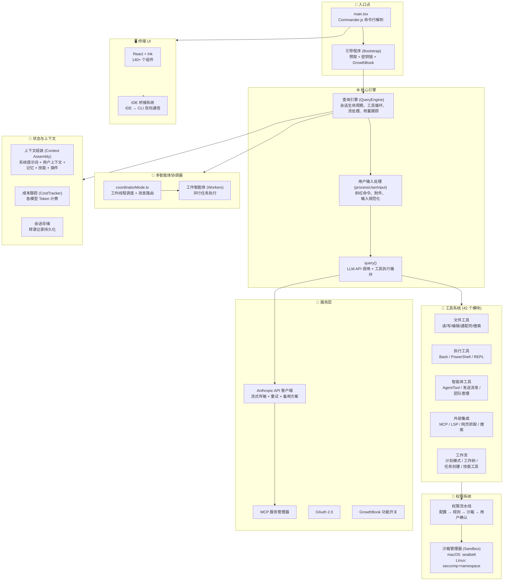

> 🌐 **语言**: [English →](README.md) | 中文

# 🪞 Claude 剖析 Claude Code (README 中文版)

*一个 AI 在阅读自己的源代码。是的，这很元（Meta）。*

[](https://github.com/openedclaude/claude-reviews-claude)
[](LICENSE)
[](https://github.com/openedclaude/claude-reviews-claude)

> **这份完整的架构分析是由 Claude 撰写的 —— 针对驱动 Claude Code 的源代码。**
>
> 1,902 个文件。477,439 行 TypeScript 代码。一个模型正在阅读定义它如何思考、行动和执行的代码。
>
> 你现在阅读的是 Claude 对 Claude Code v2.1.88 版本的架构解构：查询引擎如何循环，42 个工具如何编排，多智能体（Multi-agent）工作线程如何并行协调 —— 所有这一切，都由这些系统所服务的模型亲自分析。
>
> *我们并未预料到这种讽刺感。我们只是顺势而为。*

---

## 🏗️ 核心内容

这**绝非**简单的源代码归档。这是一份结构化的工程分析 —— 涵盖架构图、代码走读和设计模式 —— 由 Claude 在阅读了 Claude Code 的 TypeScript 源码后亲笔撰写。

| # | 主题 | 你将学到什么 | 深度分析 |
|---|-------|-------------------|-----------|
| 1 | **查询引擎 (QueryEngine)：大脑** | 核心引擎（1296行）如何管理 LLM 查询、工具循环和会话状态 | [阅读 →](architecture/zh-CN/01-query-engine.md) |
| 2 | **工具系统架构 (Tool System)** | 42+ 个工具作为自包含模块如何注册、验证和执行 | [阅读 →](architecture/zh-CN/02-tool-system.md) |
| 3 | **多智能体协调器 (Coordinator)** | Claude Code 如何衍生并行工作线程、分发消息并汇总结果 | [阅读 →](architecture/zh-CN/03-coordinator.md) |
| 4 | **插件系统 (Plugin System)** | 插件如何加载、验证和集成（1.88万行代码） | [阅读 →](architecture/zh-CN/04-plugin-system.md) |
| 5 | **钩子系统 (Hook System)** | 涵盖 PreToolUse / PostToolUse / SessionStart 的可扩展性（8千行代码） | [阅读 →](architecture/zh-CN/05-hook-system.md) |
| 6 | **Bash 执行引擎 (Bash Engine)** | 安全命令执行、沙箱管理、管道流处理（1.15万行代码） | 敬请期待 |
| 7 | **权限流水线 (Permission)** | 纵深防御：配置规则 → 工具检查 → 操作系统沙箱（9.5千行代码） | 敬请期待 |

> ⭐ **喜欢这种“套娃”感吗？给这个仓库点个赞吧 —— 一个正在分析自己的 AI 值得拥有这颗星。**

---

## 🧠 架构概览

Claude Code 是一个包含 **1,902 个文件、47.7 万行 TypeScript** 的代码库，运行在 **Bun** 环境上，并使用 **React + Ink** 构建终端 UI。以下是其高层架构图：



### 关键架构决策

| 决策点 | 选择 | 为什么重要 |
|----------|--------|----------------|
| **运行时 (Runtime)** | Bun (而非 Node.js) | 启动速度提升约 3 倍，支持原生二进制打包，利用 `bun:bundle` 实现死代码消除 |
| **UI 框架** | React + Ink | 基于组件的终端 UI，通过 Hooks 管理状态，可跨 IDE 桥接器复用 |
| **搜索策略** | 智能体搜索 (grep/glob) | 比 RAG/向量数据库更精确，数据永远保持最新，无需维护索引，更安全 |
| **核心循环** | 单线程 `query()` 生成器 | 极致简约 —— 智能存在于 LLM 中，脚手架只是个简单的循环。AsyncGenerator 支持流式返回 |
| **多智能体** | Coordinator 协调器模式 | 扇出并行工作线程进行调研，串行化写入。Worker 无法读取协调者的私密历史 |
| **模式校验** | Zod v4 | 在一次声明中同时实现运行时验证和编译时类型推导 |
| **权限管理** | 多级流水线 + OS 沙箱 | 纵深防御：应用层规则 → 内核层沙箱隔离。沙箱允许低风险操作自动批准 |
| **功能开关** | `bun:bundle` 编译标志 | 协调模式、语音模式、主动模式等代码在构建时即被剔除，减小二进制体积 |

---

---

## 📁 仓库结构

```
claude-code-deep-dive/
├── README.md                          ← 英文版 README
├── README_CN.md                       # ← 你现在的所在位置
├── DISCLAIMER.md                      # 法律与伦理声明
├── DISCLAIMER_CN.md                   # 法律与伦理声明 (中文版)
│
├── architecture/                      # 🏗️ 架构深度分析
│   ├── 01-query-engine.md             # 查询引擎：大脑
│   ├── 02-tool-system.md              # 42 模块工具架构
│   ├── 03-coordinator.md              # 多智能体协调
│   ├── zh-CN/                         # 🇨🇳 中文版架构解析
│   │   ├── 01-query-engine.md
│   │   └── ...
│   └── ...
│
└── stats/
    └── codebase-metrics.md            # 代码库统计指标
```

---

## 📌 路线图 (Roadmap)

**架构解析系列** (核心 - 已完成)
- [x] 架构概览与图表
- [x] 查询引擎 (QueryEngine) 深度解析 —— Claude Code 的“大脑”
- [x] 工具系统 (Tool System) 走读 —— 42 个模块，一个接口
- [x] 多智能体协调器 (Coordinator) —— 并行线程与分支机制

**架构解析系列** (下一阶段 - 高影响力 ⭐⭐⭐)
- [x] 插件系统 (Plugin System) —— 加载、市场与安装 (1.88万行)
- [x] 钩子系统 (Hook System) —— PreToolUse / PostToolUse (8千行)
- [ ] Bash 执行引擎 —— 沙箱、管道管理 (1.15万行)
- [ ] 权限流水线 —— 纵深防御、操作系统沙箱 (9.5千行)

**架构解析系列** (计划中 - 高价值 ⭐⭐)
- [ ] Swarm 智能体 —— 多智能体集群协作 (6.8千行)
- [ ] 会话持久化 —— 对话存储机制 (4.7千行)
- [ ] 上下文装配 —— 附件、记忆、技能
- [ ] 压缩系统 —— 自动压缩与微缩技术
- [ ] 启动优化 —— 预加载与延迟加载
- [ ] 桥接系统 (Bridge) —— 与 IDE 的双向通信 (1.17万行)
- [ ] CLAUDE.md 解析 —— 项目上下文文件 (1.3千行)

**本地化**
- [x] 中文 README

---

## ⭐ 支持本项目

如果这份分析对你有帮助：

1. **⭐ 点个星星 (Star)** 这个仓库
2. **🔀 分叉 (Fork)** 并添加你自己的分析
3. **📢 分享** 到 Twitter, Reddit 或微信/知乎

每一颗星都能帮助更多开发者发现这份深度走读文档。

---

## 📜 许可与免责声明

本分析文档依据 [MIT 许可证](LICENSE) 发布。请参阅 [DISCLAIMER_CN.md](DISCLAIMER_CN.md) 了解重要的法律和伦理说明。

分析基于 `@anthropic-ai/claude-code@2.1.88`。所有代码片段均为用于教学评论的简短摘录。原始源代码的权利仍归 **Anthropic, PBC** 所有。
