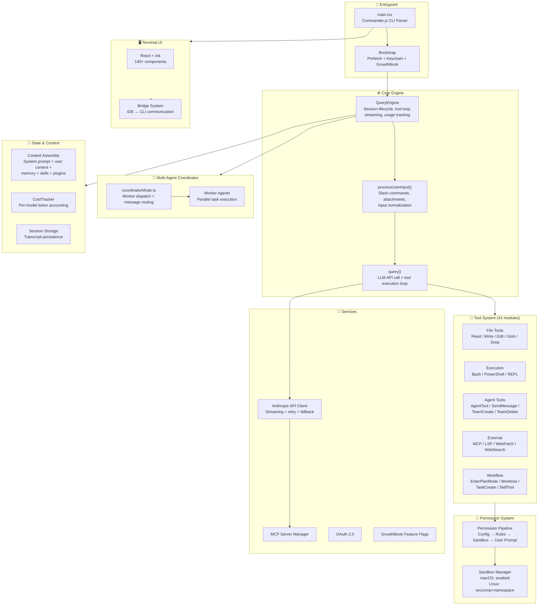

> 🌐 **Language**: [中文版 →](README.md) | English

# 🪞 Claude Reviews Claude Code

*An AI reading its own source code. Yes, really. Anthropic probably didn't see this coming either.*

*🍿 Season 1 now streaming | 9 episodes out | Claude reverse-engineers itself faster than it writes code.*

*Don't miss an episode — Star ⭐ to subscribe.*

[](https://github.com/openedclaude/claude-reviews-claude)
[](LICENSE)
[](https://github.com/openedclaude/claude-reviews-claude)

> **This entire analysis was written by Claude — about the source code that powers Claude Code.**
>
> 1,902 files. 477,439 lines of TypeScript. One model reading the code that defines how it thinks, acts, and executes.
>
> What you're reading is Claude's own architectural decomposition of Claude Code v2.1.88: how the query engine loops, how 42 tools are orchestrated, how multi-agent workers coordinate in parallel — all analyzed by the very model these systems were built to serve.
>
> *If you think this is absurd, imagine how the AI writing this analysis feels.*

---

## 🏗️ What's Inside

This is **not** a source code dump. It's a structured engineering analysis — architecture diagrams, code walkthroughs, and design patterns — written by Claude after reading Claude Code's TypeScript source.

| # | Topic | What You'll Learn | Deep Dive |
|---|-------|-------------------|-----------|
| 1 | **QueryEngine: The Brain** | How the 1,296-line core engine manages LLM queries, tool loops, and session state | [Read →](architecture/01-query-engine.md) |
| 2 | **Tool System Architecture** | How 42+ tools are registered, validated, and executed as self-contained modules | [Read →](architecture/02-tool-system.md) |
| 3 | **Multi-Agent Coordinator** | How Claude Code spawns parallel workers, routes messages, and synthesizes results | [Read →](architecture/03-coordinator.md) |
| 4 | **Plugin System** | How plugins are loaded, validated, and integrated (18.8K lines) | [Read →](architecture/04-plugin-system.md) |
| 5 | **Hook System** | PreToolUse / PostToolUse / SessionStart extensibility (8K lines) | [Read →](architecture/05-hook-system.md) |
| 6 | **Bash Execution Engine** | Secure command execution, sandbox, pipe management (11.5K lines) | [Read →](architecture/06-bash-engine.md) |
| 7 | **Permission Pipeline** | Defense-in-depth: config rules → tool checks → OS sandbox (9.5K lines) | [Read →](architecture/07-permission-pipeline.md) |
| 8 | **Agent Swarms** | Multi-agent team coordination: mailbox IPC, backend detection, permission delegation (6.8K lines) | [Read →](architecture/08-agent-swarms.md) |
| 9 | **Session Persistence** | Append-only JSONL storage, parent-UUID chains, 64KB lite resume (7.6K lines) | [Read →](architecture/09-session-persistence.md) |

> ⭐ **Enjoy the meta? Star the repo — an AI analyzing itself deserves at least that.**

---

## 📦 Source Code Access

This project's analysis is based on the TypeScript source of Claude Code v2.1.88. If you'd like to read the source code yourself, these community repositories provide the reconstructed codebase:

| Repository | Description |
|-----------|-------------|
| [instructkr/claw-code](https://github.com/instructkr/claw-code) | Reconstructed Claude Code source |
| [ChinaSiro/claude-code-sourcemap](https://github.com/ChinaSiro/claude-code-sourcemap) | Original TypeScript extracted from Source Map |

---

## 🧠 Architecture Overview

Claude Code is a **1,902-file, 477K-line TypeScript** codebase running on **Bun**, with a terminal UI built on **React + Ink**. Here's the high-level architecture:



### Key Architectural Decisions

| Decision | Choice | Why It Matters |
|----------|--------|----------------|
| **Runtime** | Bun (not Node.js) | ~3x faster startup, native binary bundling, `bun:bundle` feature flags for dead code elimination |
| **UI Framework** | React + Ink | Component-based terminal UI, state management via hooks, reusable across IDE bridges |
| **Search Strategy** | Agentic search (grep/glob) over RAG/vector DB | Better precision, always fresh, no index maintenance, security (no embedding leaks) |
| **Core Loop** | Single-threaded `query()` generator | Simplicity — intelligence lives in the LLM, the scaffold is a dumb loop. AsyncGenerator enables streaming |
| **Multi-Agent** | Coordinator pattern with `AgentTool` + `SendMessageTool` | Fan-out parallel workers for research, serialize for writes. Workers can't see coordinator's conversation |
| **Schema** | Zod v4 | Runtime validation + compile-time type inference in one declaration |
| **Permissions** | Multi-stage pipeline + OS sandbox | Defense in depth: app-level rules → sandbox isolation. Sandbox enables auto-approve for low-risk ops |
| **Feature Gating** | `bun:bundle` compile-time flags | `COORDINATOR_MODE`, `VOICE_MODE`, `PROACTIVE`, `KAIROS` etc. — dead code stripped at build time |

---

## 📊 Codebase at a Glance

| Metric | Value |
|--------|-------|
| Total Files | ~1,900 |
| Total Lines | 512,664 |
| Language | TypeScript (strict mode) |
| Runtime | Bun |
| Largest File | `main.tsx` (808 KB — bundled entrypoint) |
| Core Engine | `QueryEngine.ts` (1,296 lines) + `query.ts` (70K) |
| Built-in Tools | 42 modules |
| Slash Commands | 50+ |
| Ink UI Components | 140+ |
| Feature Flags | `PROACTIVE`, `KAIROS`, `BRIDGE_MODE`, `DAEMON`, `VOICE_MODE`, `AGENT_TRIGGERS`, `MONITOR_TOOL`, `COORDINATOR_MODE`, `HISTORY_SNIP` |

---

## 📁 Repository Structure

```
claude-code-deep-dive/
├── README.md                          ← You are here
├── DISCLAIMER.md                      # Legal & ethical notice
│
├── architecture/                      # 🏗️ Architecture Deep Dives
│   ├── 01-query-engine.md             # QueryEngine: the brain
│   ├── 02-tool-system.md              # 42-module tool architecture
│   ├── 03-coordinator.md              # Multi-agent coordination
│   ├── 04-permission-system.md        # Permission pipeline + sandbox
│   ├── 05-context-assembly.md         # Dynamic prompt assembly
│   ├── 06-startup-optimization.md     # Prefetch, lazy load, feature flags
│   ├── 07-bridge-system.md            # IDE ↔ CLI bridge
│   └── 08-design-patterns.md          # Reusable agentic patterns
│
└── stats/
    └── codebase-metrics.md            # Code statistics
```

---

## 🔑 Key Insights Preview

### 1. The Core Loop Is Deliberately "Dumb"

Claude Code's `query()` function is a simple AsyncGenerator loop: send messages → get response → if tool_use, execute tool → push result → repeat. All intelligence lives in the LLM. This is a deliberate architectural choice — a "dumb scaffold, smart model" philosophy.

### 2. Multi-Agent Coordination Is a First-Class Feature

The Coordinator mode transforms Claude Code from a single-agent CLI into an orchestrator that dispatches parallel worker agents. Workers are fully isolated — they can't see the coordinator's conversation history. The coordinator must synthesize worker results and craft self-contained prompts.

### 3. Dead Code Elimination via Feature Flags

`bun:bundle` feature flags are used at build time to completely strip unused code paths. Voice mode, proactive mode, coordinator mode — all are gated behind compile-time flags, producing a smaller binary.

### 4. Permission System Uses Defense-in-Depth

Permissions are checked at multiple levels: app-level config rules → tool-specific permission models → OS-level sandbox (seccomp on Linux, seatbelt on macOS). When sandbox is active, certain operations auto-approve — trading application-layer checks for kernel-level guarantees.

---

## 📌 Roadmap

**Architecture Series** (Core — completed)
- [x] Architecture overview + diagrams
- [x] QueryEngine deep dive — the brain of Claude Code
- [x] Tool system walkthrough — 42 modules, one interface
- [x] Multi-agent coordinator — parallel workers, fork mechanism

**Architecture Series** (Next up — high impact ⭐⭐⭐)
- [x] Plugin system — loading, marketplace, installation (18.8K lines)
- [x] Hook system — PreToolUse / PostToolUse / SessionStart (8K lines)
- [x] Bash execution engine — sandbox, pipe management (11.5K lines)
- [x] Permission pipeline — defense-in-depth, sandbox (9.5K lines)

**Architecture Series** (Planned — high value ⭐⭐)
- [x] Swarm agents — multi-agent group coordination (6.8K lines)
- [x] Session persistence — conversation storage (7.6K lines)
- [ ] Context assembly — attachments, memory, skills
- [ ] Compact system — auto-compaction, snip, microcompact
- [ ] Startup optimization — preloading, lazy imports
- [ ] Bridge system — IDE bidirectional communication (11.7K lines)
- [ ] CLAUDE.md parsing — project context files (1.3K lines)

**Localization**
- [ ] 中文 README

---

## ⭐ Support This Project

If this analysis was helpful:

1. **⭐ Star** this repository
2. **🔀 Fork** to add your own analysis
3. **📢 Share** on Twitter, Reddit, or Hacker News

Every star helps more developers discover this deep dive.

## ⭐ Star History

[](https://star-history.com/#openedclaude/claude-reviews-claude&Date)

---

## 📜 License & Disclaimer

This analysis is released under the [MIT License](LICENSE). See [DISCLAIMER.md](DISCLAIMER.md) for important legal and ethical notices.

Analysis based on `@anthropic-ai/claude-code@2.1.88`. All code snippets are brief excerpts used for educational commentary. The original source remains the property of **Anthropic, PBC**.
