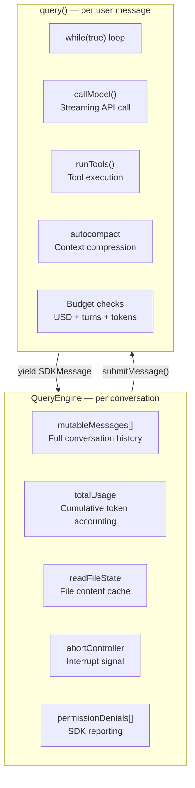
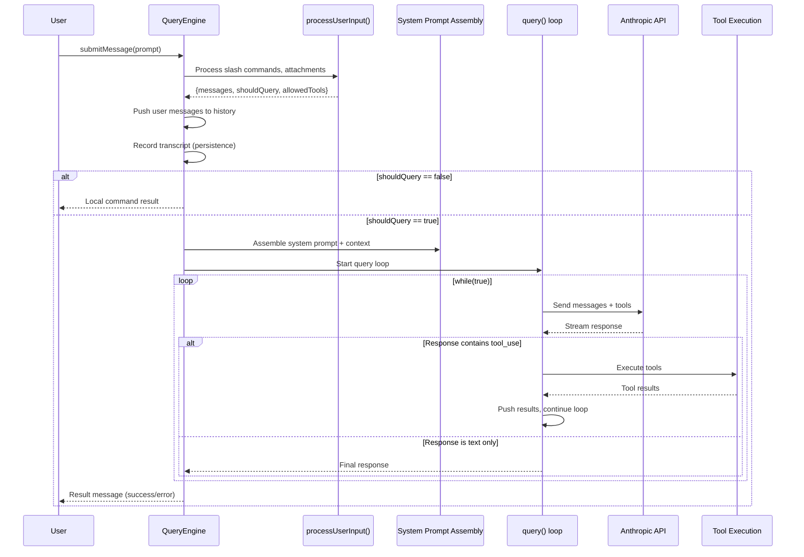
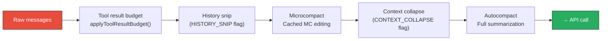

> 🌐 **Language**: English | [中文版 →](zh-CN/01-query-engine.md)

# QueryEngine: The Brain of Claude Code

> **Source files**: `QueryEngine.ts` (1,296 lines), `query.ts` (1,730 lines), `query/` directory

## TL;DR

QueryEngine is the central orchestrator of Claude Code's entire lifecycle. It owns the conversation state, manages the LLM query loop, handles streaming, tracks costs, and coordinates everything from user input processing to tool execution. The core loop in `query()` is a deliberately simple `while(true)` AsyncGenerator — all intelligence lives in the LLM, the scaffold is intentionally "dumb."

---

## 1. Two Layers: QueryEngine (Session) + query() (Turn)

The engine is split into two layers with distinct lifetimes:



| Layer | Lifetime | Responsibility |
|-------|----------|----------------|
| `QueryEngine` | Per conversation | Session state, message history, cumulative usage, file cache |
| `query()` | Per user message | API loop, tool execution, auto-compaction, budget enforcement |

### The QueryEngine Class

```typescript
export class QueryEngine {
  private config: QueryEngineConfig
  private mutableMessages: Message[]        // Full conversation
  private abortController: AbortController  // Interrupt signal
  private permissionDenials: SDKPermissionDenial[]
  private totalUsage: NonNullableUsage      // Cumulative tokens
  private readFileState: FileStateCache     // File content LRU
  private discoveredSkillNames = new Set<string>()

  async *submitMessage(prompt, options?): AsyncGenerator<SDKMessage> {
    // ... 900+ lines of orchestration
  }
}
```

---

## 2. The submitMessage() Lifecycle

Each call to `submitMessage()` follows a precise sequence:



### Phase 1: Input Processing

```typescript
const { messages, shouldQuery, allowedTools, model, resultText } = 
  await processUserInput({
    input: prompt,
    mode: 'prompt',
    context: processUserInputContext,
  })
```

`processUserInput()` handles:
- **Slash commands** (`/compact`, `/clear`, `/model`, `/bug`, etc.)
- **File attachments** (images, documents)
- **Input normalization** (content blocks vs. plain text)
- **Tool allowlisting** from command output

If `shouldQuery` is false (e.g., `/clear`), the result is returned directly without calling the API.

### Phase 2: Context Assembly

Before calling the API, the system prompt is assembled from multiple sources:

```typescript
const { defaultSystemPrompt, userContext, systemContext } = 
  await fetchSystemPromptParts({
    tools: tools,
    mainLoopModel: initialMainLoopModel,
    additionalWorkingDirectories: [...],
    mcpClients: mcpClients,
    customSystemPrompt: customPrompt,
  })

// Inject coordinator context if in coordinator mode
const userContext = {
  ...baseUserContext,
  ...getCoordinatorUserContext(mcpClients, scratchpadDir),
}

// Layer: default/custom + memory mechanics + append
const systemPrompt = asSystemPrompt([
  ...(customPrompt ? [customPrompt] : defaultSystemPrompt),
  ...(memoryMechanicsPrompt ? [memoryMechanicsPrompt] : []),
  ...(appendSystemPrompt ? [appendSystemPrompt] : []),
])
```

### Phase 3: The query() Loop

The core loop is a `while(true)` AsyncGenerator:

```typescript
for await (const message of query({
  messages,
  systemPrompt,
  userContext,
  systemContext,
  canUseTool: wrappedCanUseTool,
  toolUseContext: processUserInputContext,
  maxTurns,
  taskBudget,
})) {
  // Handle each yielded message...
}
```

### Phase 4: Result Extraction

After the loop ends, the engine extracts the final result:

```typescript
const result = messages.findLast(
  m => m.type === 'assistant' || m.type === 'user',
)

if (!isResultSuccessful(result, lastStopReason)) {
  yield { type: 'result', subtype: 'error_during_execution', ... }
} else {
  yield { type: 'result', subtype: 'success', result: textResult, ... }
}
```

---

## 3. The query() Loop: 1,730 Lines of Controlled Chaos

The `query()` function in `query.ts` is the heart of tool execution. Despite being 1,730 lines, its core structure is simple:

```
while (true) {
    1. Pre-process: snip → microcompact → context collapse → autocompact
    2. Call API: stream response
    3. Post-process: execute tools, handle errors
    4. Decision: continue (tool_use) or terminate (end_turn)
}
```

### The Pre-Processing Pipeline

Before each API call, messages pass through a multi-stage compression pipeline:



| Stage | Purpose | Feature Gate |
|-------|---------|-------------|
| **Tool result budget** | Cap aggregate tool output size, persist to disk | Always |
| **Snip** | Remove stale conversation segments | `HISTORY_SNIP` |
| **Microcompact** | Cache-aware editing of past messages | `CACHED_MICROCOMPACT` |
| **Context collapse** | Archive old turns, project collapsed view | `CONTEXT_COLLAPSE` |
| **Autocompact** | Full conversation summarization when near token limit | Always (configurable) |

### Streaming Tool Execution

Tools can execute concurrently during streaming:

```typescript
const streamingToolExecutor = new StreamingToolExecutor(
  toolUseContext.options.tools,
  canUseTool,
  toolUseContext,
)
```

When a `tool_use` block arrives in the stream, the executor begins execution immediately — before the full response finishes. This overlaps tool execution with API streaming.

### Budget Enforcement

The loop enforces three budget types:

```typescript
// 1. USD budget
if (maxBudgetUsd !== undefined && getTotalCost() >= maxBudgetUsd) {
  yield { type: 'result', subtype: 'error_max_budget_usd', ... }
  return
}

// 2. Turn budget
if (turnCount >= maxTurns) {
  yield { type: 'result', subtype: 'error_max_turns', ... }
  return
}

// 3. Token budget (per-turn output limit)
if (feature('TOKEN_BUDGET')) {
  checkTokenBudget(budgetTracker, ...)
}
```

---

## 4. State Management: The Message Switch

Inside `submitMessage()`, a large `switch` statement routes each message type:

```typescript
switch (message.type) {
  case 'assistant':     // LLM response → push to history, yield to SDK
  case 'user':          // Tool results → push to history, increment turn
  case 'progress':      // Tool progress → push and yield
  case 'stream_event':  // Raw SSE events → usage tracking, partial yields
  case 'attachment':    // Structured output, max_turns, queued commands
  case 'system':        // Compact boundaries, API errors, snip replay
  case 'tombstone':     // Message removal signals
  case 'tool_use_summary': // Aggregated tool summaries
}
```

Key design: **every message type** goes through the same yield pipeline. There are no side channels — the AsyncGenerator is the single communication path.

---

## 5. The ask() Convenience Wrapper

For one-shot usage (headless/SDK mode), `ask()` wraps QueryEngine:

```typescript
export async function* ask({ prompt, tools, ... }) {
  const engine = new QueryEngine({
    cwd, tools, commands, mcpClients,
    initialMessages: mutableMessages,
    readFileCache: cloneFileStateCache(getReadFileCache()),
    // ... 30+ config options
  })

  try {
    yield* engine.submitMessage(prompt, { uuid: promptUuid })
  } finally {
    setReadFileCache(engine.getReadFileState())
  }
}
```

The `try/finally` ensures the file state cache is always saved back — even if the generator is terminated mid-stream.

---

## 6. Error Recovery Mechanisms

The query loop handles several error recovery paths:

### Fallback Model

If the primary model fails, the loop retries with a fallback:

```typescript
try {
  for await (const message of deps.callModel({ ... })) { ... }
} catch (error) {
  if (error instanceof FallbackTriggeredError) {
    // Tombstone orphaned messages from failed attempt
    for (const msg of assistantMessages) {
      yield { type: 'tombstone', message: msg }
    }
    // Reset and retry with fallback model
    assistantMessages.length = 0
    attemptWithFallback = true
  }
}
```

### Max Output Tokens Recovery

When the model hits output token limits, the loop attempts up to 3 retries:

```typescript
const MAX_OUTPUT_TOKENS_RECOVERY_LIMIT = 3
```

### Reactive Compaction

If prompt-too-long errors occur, reactive compaction can compress the conversation on-the-fly.

---

## 7. Design Patterns Worth Stealing

### Pattern 1: AsyncGenerator as Communication Protocol

The entire engine communicates through `yield`. No callbacks, no event emitters, no message buses. The AsyncGenerator provides:
- **Backpressure**: consumer controls pace
- **Cancellation**: `.return()` propagates through `yield*`
- **Type safety**: `AsyncGenerator<SDKMessage, void, unknown>`

### Pattern 2: Mutable State with Immutable Snapshots

```typescript
this.mutableMessages.push(...messagesFromUserInput)
const messages = [...this.mutableMessages]  // Snapshot for query loop
```

The engine maintains a mutable message array (for persistence across turns) but takes immutable snapshots for each query loop iteration.

### Pattern 3: Permission Wrapping via Closure

```typescript
const wrappedCanUseTool: CanUseToolFn = async (tool, input, ...) => {
  const result = await canUseTool(tool, input, ...)
  if (result.behavior !== 'allow') {
    this.permissionDenials.push({
      tool_name: sdkCompatToolName(tool.name),
      tool_use_id: toolUseID,
      tool_input: input,
    })
  }
  return result
}
```

Permission tracking is injected transparently — the query loop doesn't know it's being monitored.

### Pattern 4: Watermark-Based Error Scoping

```typescript
const errorLogWatermark = getInMemoryErrors().at(-1)
// ... later, on error:
const all = getInMemoryErrors()
const start = errorLogWatermark ? all.lastIndexOf(errorLogWatermark) + 1 : 0
errors = all.slice(start).map(_ => _.error)
```

Instead of counting errors (which breaks when the ring buffer rotates), the engine saves a reference to the last error and slices from there. Turn-scoped errors without a counter.

---

## Summary

| Aspect | Detail |
|--------|--------|
| **QueryEngine** | 1,296 lines, per-conversation lifecycle, owns message history + usage |
| **query()** | 1,730 lines, per-turn `while(true)` loop with tool execution |
| **Communication** | Pure AsyncGenerator — no callbacks, no events |
| **Pre-processing** | 5-stage compression pipeline (budget → snip → MC → collapse → autocompact) |
| **Budget limits** | USD, turns, tokens — all enforced in the loop |
| **Error recovery** | Fallback model, max-output retry (3x), reactive compaction |
| **Key principle** | "Dumb scaffold, smart model" — the loop is simple, intelligence is in the LLM |
