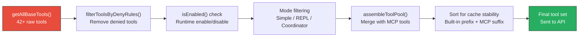

> 🌐 **Language**: English | [中文版 →](zh-CN/02-tool-system.md)

# Tool System Architecture: 42 Modules, One Interface

> **Source files**: `Tool.ts` (793 lines — interface definition), `tools.ts` (390 lines — registry), `tools/` (42+ directories)

## TL;DR

Every action Claude Code takes — reading a file, running bash, searching the web, spawning a sub-agent — goes through a single unified `Tool` interface. 42+ tool modules, each self-contained in its own directory, are assembled at startup through a layered filtering system: feature flags → permission rules → mode restrictions → deny lists.

---

## 1. The Tool Interface: 30+ Methods, One Contract

Every tool in Claude Code implements the same `Tool<Input, Output, Progress>` type. This is a massive interface (793-line file) that covers:

```typescript
export type Tool<Input, Output, P> = {
  // Identity
  readonly name: string
  aliases?: string[]              // Legacy name support
  searchHint?: string             // Keyword for ToolSearch discovery

  // Schema (Zod v4)
  readonly inputSchema: Input     // Runtime validation + TS inference
  outputSchema?: z.ZodType

  // Core execution
  call(args, context, canUseTool, parentMessage, onProgress?): Promise<ToolResult<Output>>

  // Permission pipeline
  validateInput?(input, context): Promise<ValidationResult>
  checkPermissions(input, context): Promise<PermissionResult>
  preparePermissionMatcher?(input): Promise<(pattern: string) => boolean>

  // Behavioral flags
  isEnabled(): boolean
  isReadOnly(input): boolean
  isConcurrencySafe(input): boolean
  isDestructive?(input): boolean
  interruptBehavior?(): 'cancel' | 'block'

  // UI rendering (React + Ink)
  renderToolUseMessage(input, options): React.ReactNode
  renderToolResultMessage?(content, progress, options): React.ReactNode
  renderToolUseProgressMessage?(progress, options): React.ReactNode
  renderGroupedToolUse?(toolUses, options): React.ReactNode | null
  // ... 10+ more render methods
}
```

### The buildTool() Factory

Rather than requiring every tool to implement all 30+ methods, Claude Code uses a factory function with fail-closed defaults:

```typescript
const TOOL_DEFAULTS = {
  isEnabled: () => true,
  isConcurrencySafe: () => false,    // Assume NOT safe
  isReadOnly: () => false,           // Assume writes
  isDestructive: () => false,
  checkPermissions: (input) =>       // Defer to general system
    Promise.resolve({ behavior: 'allow', updatedInput: input }),
  toAutoClassifierInput: () => '',   // Skip classifier
  userFacingName: () => '',
}

export function buildTool<D>(def: D): BuiltTool<D> {
  return { ...TOOL_DEFAULTS, userFacingName: () => def.name, ...def }
}
```

**Design insight**: Defaults are intentionally conservative. A tool that forgets to declare `isConcurrencySafe` defaults to `false` (serialize), not `true` (parallel). A tool that forgets `isReadOnly` defaults to `false` (requires permission). This is _fail-closed_ security by default.

---

## 2. The Tool Registry: Static Array with Dynamic Filtering

All tools are registered in `tools.ts` via `getAllBaseTools()`. This returns a flat array — **not** a plugin registry, not a map, not a DI container. Intentionally simple.

```typescript
export function getAllBaseTools(): Tools {
  return [
    AgentTool,          // Sub-agent spawning
    TaskOutputTool,     // Structured output
    BashTool,           // Shell commands
    GlobTool, GrepTool, // Search (conditional)
    FileReadTool,       // Read files
    FileEditTool,       // Edit files
    FileWriteTool,      // Create files
    NotebookEditTool,   // Jupyter notebooks
    WebFetchTool,       // HTTP requests
    WebSearchTool,      // Web search
    TodoWriteTool,      // Todo management
    // ... 30+ more
  ]
}
```

### Feature-Gated Tools

Many tools only appear when specific build flags are enabled:

```mermaid
graph TD
    ALL["getAllBaseTools()"] --> ALWAYS["Always Available"]
    ALL --> GATED["Feature-Gated"]
    ALL --> ENV["Environment-Gated"]

    ALWAYS --> A1["BashTool"]
    ALWAYS --> A2["FileReadTool"]
    ALWAYS --> A3["FileEditTool"]
    ALWAYS --> A4["FileWriteTool"]
    ALWAYS --> A5["AgentTool"]
    ALWAYS --> A6["WebFetchTool"]
    ALWAYS --> A7["WebSearchTool"]

    GATED --> G1["PROACTIVE → SleepTool"]
    GATED --> G2["AGENT_TRIGGERS → CronCreate/Delete/List"]
    GATED --> G3["MONITOR_TOOL → MonitorTool"]
    GATED --> G4["KAIROS → SendUserFileTool, PushNotificationTool"]
    GATED --> G5["COORDINATOR_MODE → coordinatorMode"]
    GATED --> G6["HISTORY_SNIP → SnipTool"]
    GATED --> G7["WEB_BROWSER_TOOL → WebBrowserTool"]
    GATED --> G8["WORKFLOW_SCRIPTS → WorkflowTool"]

    ENV --> E1["USER_TYPE=ant → REPLTool, ConfigTool, TungstenTool"]
    ENV --> E2["ENABLE_LSP_TOOL → LSPTool"]
    ENV --> E3["NODE_ENV=test → TestingPermissionTool"]

    style ALWAYS fill:#27AE60,stroke:#333,color:#fff
    style GATED fill:#E67E22,stroke:#333,color:#fff
    style ENV fill:#8E44AD,stroke:#333,color:#fff
```



The conditional loading pattern uses `bun:bundle` for compile-time elimination:

```typescript
// Compile-time: if PROACTIVE is false, this entire block is dead code
const SleepTool = feature('PROACTIVE') || feature('KAIROS')
  ? require('./tools/SleepTool/SleepTool.js').SleepTool
  : null
```

This means the Bun bundler physically strips the tool from the binary when the flag is off — not just `if`-gating it at runtime.

---

## 3. Tool Categories

The 42+ tools fall into 6 functional categories:

### 📁 File Operations (7 tools)

| Tool | Purpose | Concurrency Safe? |
|------|---------|-------------------|
| `FileReadTool` | Read file contents | ✅ Yes |
| `FileWriteTool` | Create/overwrite files | ❌ No |
| `FileEditTool` | Surgical text edits | ❌ No |
| `GlobTool` | Find files by pattern | ✅ Yes |
| `GrepTool` | Search file content | ✅ Yes |
| `NotebookEditTool` | Edit Jupyter notebooks | ❌ No |
| `SnipTool` | History snipping | ❌ No |

### 🖥️ Execution (3-4 tools)

| Tool | Purpose | Feature Gate |
|------|---------|-------------|
| `BashTool` | Shell commands | Always |
| `PowerShellTool` | Windows PS commands | Runtime check |
| `REPLTool` | VM-based REPL | `USER_TYPE=ant` |
| `SleepTool` | Wait/delay | `PROACTIVE` / `KAIROS` |

### 🤖 Agent Management (6 tools)

| Tool | Purpose | Feature Gate |
|------|---------|-------------|
| `AgentTool` | Spawn sub-agents | Always |
| `SendMessageTool` | Continue a worker | Always |
| `TaskStopTool` | Kill a worker | Always |
| `TeamCreateTool` | Create agent swarm | `AGENT_SWARMS` |
| `TeamDeleteTool` | Delete agent swarm | `AGENT_SWARMS` |
| `ListPeersTool` | List peer agents | `UDS_INBOX` |

### 🌐 External (5+ tools)

| Tool | Purpose | Feature Gate |
|------|---------|-------------|
| `WebFetchTool` | HTTP fetch | Always |
| `WebSearchTool` | Web search | Always |
| `WebBrowserTool` | Browser automation | `WEB_BROWSER_TOOL` |
| `ListMcpResourcesTool` | Browse MCP resources | Conditional |
| `ReadMcpResourceTool` | Read MCP resource | Conditional |
| `LSPTool` | Language Server Protocol | `ENABLE_LSP_TOOL` |

### 📋 Workflow & Planning (8+ tools)

| Tool | Purpose | Feature Gate |
|------|---------|-------------|
| `EnterPlanModeTool` | Enter planning mode | Always |
| `ExitPlanModeV2Tool` | Exit planning mode | Always |
| `EnterWorktreeTool` | Git worktree isolation | Worktree mode |
| `ExitWorktreeTool` | Exit worktree | Worktree mode |
| `SkillTool` | Execute skill files | Always |
| `TaskCreateTool` | Create task | Todo v2 |
| `TaskUpdateTool` | Update task | Todo v2 |
| `TaskListTool` | List tasks | Todo v2 |
| `WorkflowTool` | Run workflow scripts | `WORKFLOW_SCRIPTS` |

### 📡 Notifications & Monitoring (4 tools)

| Tool | Purpose | Feature Gate |
|------|---------|-------------|
| `MonitorTool` | Process monitoring | `MONITOR_TOOL` |
| `SendUserFileTool` | Send file to user | `KAIROS` |
| `PushNotificationTool` | Push notifications | `KAIROS` |
| `SubscribePRTool` | GitHub PR events | `KAIROS_GITHUB_WEBHOOKS` |

---

## 4. The Assembly Pipeline

Tools don't go from registry to LLM directly. They pass through a multi-stage filtering pipeline:



### Stage 1: Deny Rules

```typescript
export function filterToolsByDenyRules(tools, permissionContext) {
  return tools.filter(tool => !getDenyRuleForTool(permissionContext, tool))
}
```

### Stage 2: Mode Filtering

In **Simple mode** (`CLAUDE_CODE_SIMPLE`), only 3 tools survive:
```typescript
if (isEnvTruthy(process.env.CLAUDE_CODE_SIMPLE)) {
  const simpleTools = [BashTool, FileReadTool, FileEditTool]
  // If also coordinator mode, add AgentTool + TaskStopTool
  return filterToolsByDenyRules(simpleTools, permissionContext)
}
```

In **REPL mode**, primitive tools are hidden (they're wrapped inside the REPL VM):
```typescript
if (isReplModeEnabled()) {
  allowedTools = allowedTools.filter(
    tool => !REPL_ONLY_TOOLS.has(tool.name)
  )
}
```

### Stage 3: MCP Tool Merging

MCP (Model Context Protocol) tools from external servers are merged after built-in tools:

```typescript
export function assembleToolPool(permissionContext, mcpTools): Tools {
  const builtInTools = getTools(permissionContext)
  const allowedMcpTools = filterToolsByDenyRules(mcpTools, permissionContext)

  // Sort: built-in prefix + MCP suffix for prompt cache stability
  return uniqBy(
    [...builtInTools].sort(byName).concat(allowedMcpTools.sort(byName)),
    'name',
  )
}
```

**Key insight**: Built-in tools are sorted as a contiguous prefix, MCP tools as a suffix. This preserves prompt cache stability — adding/removing an MCP tool doesn't invalidate cache for built-in tools.

---

## 5. Tool Search: Lazy Loading for Large Tool Sets

When too many tools are available (MCP can add dozens), a `ToolSearchTool` enables lazy loading:

```typescript
// Tools can declare themselves as deferrable
readonly shouldDefer?: boolean    // Sent with defer_loading: true
readonly alwaysLoad?: boolean     // Never deferred, even with ToolSearch

// ToolSearch uses keyword matching
searchHint?: string  // e.g., 'jupyter' for NotebookEditTool
```

This prevents the LLM's tool schema from becoming overwhelming. Deferred tools aren't in the initial prompt — the model discovers them via `ToolSearchTool` by keyword.

---

## 6. Directory Convention

Each tool follows a consistent directory structure:

```
tools/BashTool/
├── BashTool.ts      # Tool implementation (buildTool({ ... }))
├── prompt.ts        # LLM-facing description text
├── UI.tsx           # React+Ink rendering components
├── constants.ts     # Tool name, limits
└── (optional)
    ├── utils.ts     # Helper functions
    ├── types.ts     # Type definitions
    └── __tests__/   # Tests
```

Larger tools like `AgentTool` have more complex structures:

```
tools/AgentTool/
├── AgentTool.tsx     # 235K — main implementation
├── UI.tsx            # 126K — rendering
├── runAgent.ts       # 37K  — agent execution
├── agentToolUtils.ts # 23K  — utilities
├── prompt.ts         # 17K  — LLM description
├── forkSubagent.ts   # 9K   — fork mechanism
├── resumeAgent.ts    # 10K  — session resume
├── agentMemory.ts    # 6K   — memory management
├── loadAgentsDir.ts  # 27K  — agent definition loading
├── constants.ts
├── builtInAgents.ts
├── agentColorManager.ts
├── agentDisplay.ts
└── built-in/         # Built-in agent definitions
```

---

## 7. Design Patterns Worth Stealing

### Pattern 1: Behavioral Flags Over Capability Classes

Instead of inheritance hierarchies (`ReadOnlyTool`, `WritableTool`, `ConcurrentTool`), Claude Code uses boolean method flags:

```typescript
isReadOnly(input): boolean      // Can skip permission for read-only ops
isConcurrencySafe(input): boolean  // Can run in parallel
isDestructive?(input): boolean  // Irreversible (delete, overwrite)
```

These flags can be **input-dependent** — e.g., `BashTool.isReadOnly()` returns `true` for `ls` but `false` for `rm`. This is more flexible than class hierarchies.

### Pattern 2: Prompt Cache Stability via Sort Order

Tools are sorted deterministically (built-in prefix + MCP suffix) so that adding an MCP server doesn't invalidate the prompt cache for all tools. This saves significant API cost at scale.

### Pattern 3: Self-Contained Modules

Each tool directory contains everything: implementation, prompt text, UI rendering, tests. No tool reaches into another tool's directory. This makes each tool independently maintainable and testable.

### Pattern 4: Fail-Closed Defaults via buildTool()

The factory pattern ensures security by default — `isConcurrencySafe: false`, `isReadOnly: false`. A developer who forgets to set a flag gets the safer behavior, not the dangerous one.

---

## Summary

| Aspect | Detail |
|--------|--------|
| **Interface** | Single `Tool` type, 30+ methods (793-line file) |
| **Registry** | Flat array in `getAllBaseTools()`, not a plugin system |
| **Total tools** | 42+ built-in + unlimited MCP tools |
| **Gating** | 3 layers: build flags (`bun:bundle`), env vars, runtime checks |
| **Assembly** | `getAllBaseTools()` → deny filter → mode filter → MCP merge → sort |
| **Schema** | Zod v4 for runtime validation + type inference |
| **Convention** | One directory per tool, self-contained (impl + prompt + UI) |
| **Defaults** | Fail-closed via `buildTool()` factory |
