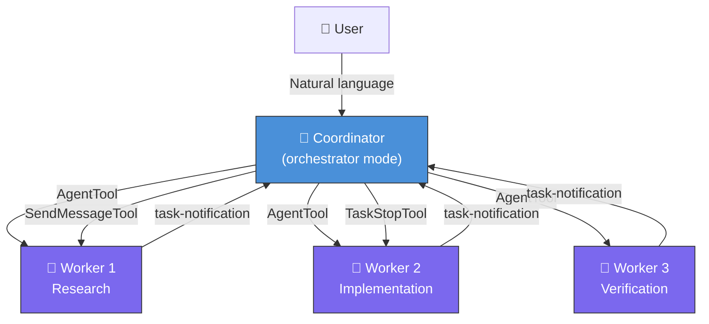
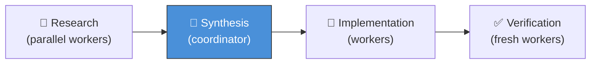

> 🌐 **Language**: English | [中文版 →](zh-CN/03-coordinator.md)

# Multi-Agent Coordinator: How Claude Code Orchestrates Parallel Workers

> **Source files**: `coordinator/coordinatorMode.ts` (370 lines), `tools/AgentTool/` (14 files), `tools/SendMessageTool/`, `tools/TeamCreateTool/`, `tools/TeamDeleteTool/`, `tools/TaskStopTool/`

## TL;DR

Claude Code isn't just a single-agent CLI. It has a hidden **Coordinator mode** that transforms it into a multi-agent orchestrator — dispatching parallel worker agents, routing messages between them, and synthesizing results. This is gated behind a compile-time feature flag and not documented anywhere in the official repo.

---

## 1. The Two Modes

Claude Code operates in one of two modes, controlled by a `bun:bundle` feature flag:

```typescript
// coordinator/coordinatorMode.ts
export function isCoordinatorMode(): boolean {
  if (feature('COORDINATOR_MODE')) {
    return isEnvTruthy(process.env.CLAUDE_CODE_COORDINATOR_MODE)
  }
  return false
}
```

| Mode | Behavior |
|------|----------|
| **Normal** (default) | Single agent with full tool access — the standard CLI experience |
| **Coordinator** | Orchestrator that dispatches workers, cannot use file/bash tools directly |

The mode is determined at startup by a combination of:
1. The `COORDINATOR_MODE` build flag (compile-time — stripped if disabled)
2. The `CLAUDE_CODE_COORDINATOR_MODE` environment variable (runtime)

### Session Persistence

When resuming a session, the mode must match:

```typescript
export function matchSessionMode(
  sessionMode: 'coordinator' | 'normal' | undefined,
): string | undefined {
  const currentIsCoordinator = isCoordinatorMode()
  const sessionIsCoordinator = sessionMode === 'coordinator'

  if (currentIsCoordinator === sessionIsCoordinator) return undefined

  // Flip the env var live — no restart needed
  if (sessionIsCoordinator) {
    process.env.CLAUDE_CODE_COORDINATOR_MODE = '1'
  } else {
    delete process.env.CLAUDE_CODE_COORDINATOR_MODE
  }
  // ...
}
```

This means Claude Code can dynamically switch modes mid-process to match a resumed session — the env var is read live, not cached.

---

## 2. Architecture: Coordinator vs. Workers



### Key Principle: Complete Context Isolation

**Workers cannot see the coordinator's conversation.** Every worker starts with zero context. The coordinator must write self-contained prompts that include everything the worker needs — file paths, line numbers, error messages, what "done" looks like.

This is enforced architecturally, not by convention:

```typescript
// From the coordinator system prompt:
// "Workers can't see your conversation. Every prompt must be
//  self-contained with everything the worker needs."
```

### The Coordinator's Toolbox

In coordinator mode, the agent gets a restricted set of tools:

| Tool | Purpose |
|------|---------|
| `Agent` | Spawn a new worker agent |
| `SendMessage` | Send a follow-up message to an existing worker |
| `TaskStop` | Kill a running worker |
| `subscribe_pr_activity` | Subscribe to GitHub PR events (if available) |

Notice what's **missing**: `BashTool`, `FileReadTool`, `FileWriteTool`, `GrepTool` — the coordinator delegates all hands-on work to workers.

---

## 3. The Worker Lifecycle

### 3.1 Spawning Workers

Workers are spawned via `AgentTool`. Each worker is a subprocess with its own tool set:

```typescript
// coordinatorMode.ts
const workerTools = isEnvTruthy(process.env.CLAUDE_CODE_SIMPLE)
  ? [BASH_TOOL_NAME, FILE_READ_TOOL_NAME, FILE_EDIT_TOOL_NAME]
      .sort().join(', ')
  : Array.from(ASYNC_AGENT_ALLOWED_TOOLS)
      .filter(name => !INTERNAL_WORKER_TOOLS.has(name))
      .sort().join(', ')
```

Two modes determine what tools workers get:
- **Simple mode** (`CLAUDE_CODE_SIMPLE`): Bash, Read, Edit only
- **Full mode**: All standard tools + MCP tools + Skills, minus internal coordinator-only tools

Internal-only tools that workers cannot access:

```typescript
const INTERNAL_WORKER_TOOLS = new Set([
  TEAM_CREATE_TOOL_NAME,
  TEAM_DELETE_TOOL_NAME,
  SEND_MESSAGE_TOOL_NAME,
  SYNTHETIC_OUTPUT_TOOL_NAME,
])
```

### 3.2 Worker Results as XML Notifications

When a worker completes, the result is delivered to the coordinator as a **user-role message** containing XML:

```xml
<task-notification>
  <task-id>{agentId}</task-id>
  <status>completed|failed|killed</status>
  <summary>{human-readable status}</summary>
  <result>{agent's final text response}</result>
  <usage>
    <total_tokens>N</total_tokens>
    <tool_uses>N</tool_uses>
    <duration_ms>N</duration_ms>
  </usage>
</task-notification>
```

This is architecturally elegant: notifications look like user messages but aren't. The coordinator must distinguish them by the `<task-notification>` tag. The LLM sees them in the conversation flow naturally.

### 3.3 Continuing Workers

Workers can be continued — their full context is preserved:

```typescript
// SendMessageTool: continue a worker with follow-up instructions
SendMessage({ to: "agent-xyz", message: "Fix the test assertions..." })
```

The coordinator decides whether to continue or spawn fresh based on context overlap:

| Scenario | Action | Rationale |
|----------|--------|-----------|
| Research explored the right files → now implement | **Continue** | Worker has the files in context |
| Research was broad, implementation is narrow | **Spawn fresh** | Avoid context noise |
| Worker reported failure | **Continue** | Worker has the error context |
| Verifying another worker's code | **Spawn fresh** | Fresh eyes, no implementation assumptions |
| Wrong approach entirely | **Spawn fresh** | Avoid anchoring on failed path |

### 3.4 Stopping Workers

Workers can be killed mid-flight:

```typescript
// Scenario: user changes requirements after worker was launched
TaskStop({ task_id: "agent-x7q" })
// Then optionally continue with corrected instructions:
SendMessage({ to: "agent-x7q", message: "Stop the JWT refactor..." })
```

---

## 4. The Coordinator's Workflow Model

The system prompt defines a 4-phase workflow:



### Phase 1: Research (Parallel)

Multiple workers investigate the codebase concurrently:

```
Agent({ description: "Investigate auth bug", 
        prompt: "Find null pointer exceptions in src/auth/..." })
Agent({ description: "Research auth tests", 
        prompt: "Find all test files related to src/auth/..." })
```

### Phase 2: Synthesis (Coordinator Only)

**This is the coordinator's most important job.** It reads worker findings, understands the problem, and crafts specific implementation specs. The system prompt explicitly forbids lazy delegation:

> *"Never write 'based on your findings' or 'based on the research.' These phrases delegate understanding to the worker instead of doing it yourself."*

### Phase 3: Implementation (Sequential Workers)

Workers make targeted changes per the coordinator's synthesized spec. Concurrency rules:
- **Read-only tasks**: parallel freely
- **Write-heavy tasks**: one at a time per file set
- **Verification**: can run alongside implementation on different files

### Phase 4: Verification (Fresh Workers)

Verification workers are spawned fresh — never continued from the implementation worker — to ensure independent review.

---

## 5. Scratchpad: Cross-Worker Shared State

Workers are isolated, but they need a way to share data. The solution is a **scratchpad directory**:

```typescript
if (scratchpadDir && isScratchpadGateEnabled()) {
  content += `\nScratchpad directory: ${scratchpadDir}\n` +
    `Workers can read and write here without permission prompts. ` +
    `Use this for durable cross-worker knowledge.`
}
```

The scratchpad is:
- A filesystem directory that all workers can read/write
- No permission prompts required (unlike normal file operations)
- Gated behind the `tengu_scratch` feature flag
- Injected into the coordinator's user context via dependency injection from QueryEngine

---

## 6. Fork Subagent: Context-Sharing Optimization

Beyond standard workers, there's a **fork** mechanism gated behind another feature flag:

```typescript
// From AgentTool/prompt.ts
const forkEnabled = isForkSubagentEnabled()
```

| Spawn Type | Context | Cache | Use Case |
|-----------|---------|-------|----------|
| **Fresh agent** (`subagent_type: "worker"`) | Zero context | New cache | Independent tasks |
| **Fork** (omit `subagent_type`) | Inherits parent's full context | Shared parent cache | Research, open-ended questions |

Forks are an optimization — they reuse the parent's prompt cache, saving tokens. The trade-off: a fork with a different model can't reuse the cache.

Key rule from the prompt engineering:

> *"Don't peek. The tool result includes an output_file path — do not Read or tail it unless the user explicitly asks. Reading the transcript mid-flight pulls the fork's tool noise into your context."*

---

## 7. Design Patterns Worth Stealing

### Pattern 1: Compile-Time Feature Gating

```typescript
const getCoordinatorUserContext = feature('COORDINATOR_MODE')
  ? require('./coordinator/coordinatorMode.js').getCoordinatorUserContext
  : () => ({})
```

When `COORDINATOR_MODE` is false at build time, the entire coordinator module is dead-code eliminated. The import never happens. This keeps the binary small for users who don't need coordination.

### Pattern 2: XML Notifications in User Messages

Worker results arrive as user-role messages with XML tags. This avoids creating a separate message type or side channel — the LLM handles structured XML naturally within the conversation flow.

### Pattern 3: Context Isolation by Design

Workers are architecturally isolated — they literally start a new process with a fresh conversation. This isn't enforced by access control; it's a consequence of the subprocess architecture. The coordinator must be explicit because it has no choice.

### Pattern 4: Synthesis as a First-Class Responsibility

The coordinator prompt explicitly makes synthesis the coordinator's job. This prevents the "telephone game" anti-pattern where instructions degrade across delegation layers.

---

## 8. Integration with QueryEngine

The coordinator mode hooks into QueryEngine through dependency injection:

```typescript
// QueryEngine.ts
const userContext = {
  ...baseUserContext,
  ...getCoordinatorUserContext(
    mcpClients,
    isScratchpadEnabled() ? getScratchpadDir() : undefined,
  ),
}
```

When coordinator mode is active, additional context is injected:
1. The list of tools available to workers
2. Connected MCP server names (workers can use MCP tools)
3. Scratchpad directory path (if enabled)

The coordinator also gets a completely different system prompt via `getCoordinatorSystemPrompt()` — 370 lines of detailed orchestration instructions replacing the standard agent prompt.

---

## Summary

| Aspect | Detail |
|--------|--------|
| **Activation** | `COORDINATOR_MODE` build flag + `CLAUDE_CODE_COORDINATOR_MODE` env var |
| **Coordinator tools** | Agent, SendMessage, TaskStop (no file/bash access) |
| **Worker isolation** | Complete — zero shared conversation context |
| **Communication** | XML `<task-notification>` in user-role messages |
| **Shared state** | Scratchpad directory (feature-gated) |
| **Fork optimization** | Context-inheriting forks share prompt cache |
| **Workflow** | Research → Synthesis → Implementation → Verification |
| **Key principle** | "Never delegate understanding" — coordinator synthesizes, workers execute |
