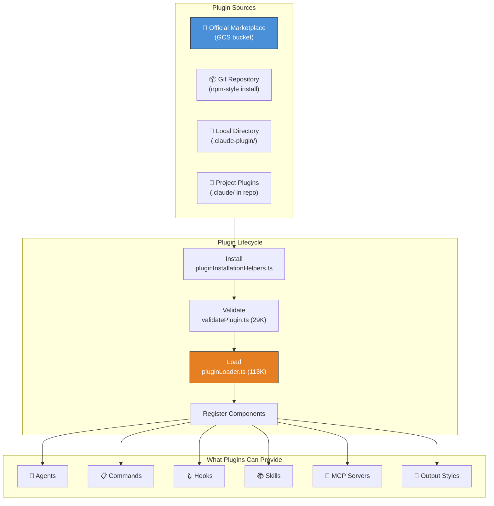
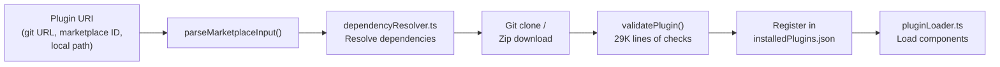

> 🌐 **Language**: English | [中文版 →](zh-CN/04-plugin-system.md)

# Plugin System: 44 Files, Full Lifecycle Management

> **Source files**: `utils/plugins/` (44 files, 18,856 lines), `components/ManagePlugins.tsx` (2,089 lines)

## TL;DR

Claude Code has a full plugin ecosystem hidden under the hood — with a marketplace, dependency resolution, auto-update, blocklisting, zip caching, and hot-reload. It's far more sophisticated than the official docs suggest. The plugin loader alone (`pluginLoader.ts`) is 113K bytes — larger than most entire npm packages.

---

## 1. Plugin Architecture at a Glance



---

## 2. The Plugin Manifest

Every plugin must have a `.claude-plugin/plugin.json` manifest:

```typescript
// From schemas.ts (60K — the largest schema file in the codebase)
{
  "name": "my-plugin",
  "description": "What this plugin does",
  "version": "1.0.0",
  "commands": ["commands/*.md"],
  "agents": ["agents/*.md"],
  "hooks": { ... },
  "mcpServers": { ... },
  "skills": ["skills/*/SKILL.md"],
  "outputStyle": "styles/custom.md"
}
```

The schema validation in `schemas.ts` is **60,595 bytes** — more than most entire plugins. It validates everything from command frontmatter to MCP server configurations.

---

## 3. Key Files in the Plugin System

| File | Size | Purpose |
|------|------|---------|
| **`pluginLoader.ts`** | **113K** | Core loader — discovers, reads, validates, and registers all plugins |
| **`marketplaceManager.ts`** | **96K** | Marketplace browsing, search, installation from official catalog |
| **`schemas.ts`** | **61K** | Zod validation schemas for all plugin manifest formats |
| **`installedPluginsManager.ts`** | **43K** | Manages installed plugin state, activation, deactivation |
| **`loadPluginCommands.ts`** | **31K** | Parses markdown command files with YAML frontmatter |
| **`mcpbHandler.ts`** | **32K** | MCP bridge handler for plugin-provided MCP servers |
| **`validatePlugin.ts`** | **29K** | Multi-pass plugin validation before activation |
| **`pluginInstallationHelpers.ts`** | **21K** | Git clone, npm install, dependency resolution |
| **`mcpPluginIntegration.ts`** | **21K** | Integrates plugin-declared MCP servers into the tool pool |
| **`marketplaceHelpers.ts`** | **19K** | Helper functions for marketplace operations |
| **`dependencyResolver.ts`** | **12K** | Resolves plugin dependency graphs |
| **`zipCache.ts`** | **14K** | Caches downloaded plugins as zip files for offline use |

---

## 4. Plugin Lifecycle

### 4.1 Discovery

Plugins are discovered from multiple locations:

```
1. Built-in plugins    — bundled with the binary
2. Project plugins     — .claude/ directory in the project
3. User plugins        — ~/.config/claude-code/plugins/
4. Marketplace plugins — official GCS bucket catalog
```

### 4.2 Installation



### 4.3 Validation

`validatePlugin.ts` (29K) runs extensive checks:
- Manifest schema validation (Zod)
- Command file syntax validation
- Hook command safety checks
- MCP server configuration validation
- Circular dependency detection
- Version compatibility checks

### 4.4 Loading

`pluginLoader.ts` (113K — the second largest file in the codebase) handles:
- Parallel loading of all plugin components
- Hook registration
- Agent definition merging
- Command registration with deduplication
- MCP server startup
- Skill directory registration
- Error isolation (one plugin failing doesn't crash others)

---

## 5. Marketplace System

### Official Marketplace (`officialMarketplaceGcs.ts`)

The marketplace is a GCS (Google Cloud Storage) bucket serving a plugin catalog:

```typescript
// officialMarketplace.ts
const OFFICIAL_MARKETPLACE_NAMES = new Set([
  'official',     // Production marketplace
  'staging',      // Staging environment
])
```

Features:
- **Startup check** (`officialMarketplaceStartupCheck.ts`, 15.6K) — checks for plugin updates on launch
- **Auto-update** (`pluginAutoupdate.ts`, 9.8K) — background auto-update mechanism
- **Blocklist** (`pluginBlocklist.ts`, 4.5K) — remotely disable compromised plugins
- **Flagging** (`pluginFlagging.ts`, 5.8K) — flag plugins for review
- **Install counts** (`installCounts.ts`, 8.6K) — telemetry for marketplace popularity

### Zip Cache System

Downloaded plugins are cached as zip files to avoid re-downloading:

```typescript
// zipCache.ts — 14K
// Plugins are cached in ~/.config/claude-code/plugin-cache/
// Keyed by content hash for deduplication
// zipCacheAdapters.ts — 5.5K  
// Adapters for different storage backends
```

---

## 6. What Plugins Can Provide

### Agents

```typescript
// loadPluginAgents.ts — 12.8K
// Plugins define agents as markdown files:
// agents/code-reviewer.md → becomes available as subagent_type: "code-reviewer"
```

### Commands (Slash Commands)

```typescript
// loadPluginCommands.ts — 31K
// Markdown files with YAML frontmatter:
// commands/review-pr.md → becomes /review-pr
// Frontmatter supports: allowed_tools, model, description
```

### Hooks

```typescript
// loadPluginHooks.ts — 10.4K
// Plugin hooks.json → registered as PreToolUse/PostToolUse/etc hooks
// Plugin hooks run with workspace trust checks
```

### MCP Servers

```typescript
// mcpPluginIntegration.ts — 21K
// Plugins can declare MCP servers that auto-start
// mcpbHandler.ts — 32K  
// MCP bridge: proxies between plugin MCP servers and Claude Code
```

### Skills

```typescript
// Skills are markdown files (SKILL.md) with trigger patterns
// Auto-discovered from plugin skill directories
```

### Output Styles

```typescript
// loadPluginOutputStyles.ts — 5.9K
// Custom output formatting (explanatory, learning, etc.)
```

---

## 7. Security & Trust Model

### Plugin Policy

```typescript
// pluginPolicy.ts
// Plugins from untrusted sources require explicit user approval
// Managed plugins (from official marketplace) have elevated trust
```

### Blocklist

```typescript
// pluginBlocklist.ts
// Remote blocklist can disable plugins by ID
// Checked on every startup and plugin load
```

### Orphan Filter

```typescript
// orphanedPluginFilter.ts — 4K
// Detects plugins whose source repo was deleted
// Prevents dangling references
```

---

## 8. Design Patterns Worth Stealing

### Pattern 1: Isolation by Default

Each plugin loads in isolation. One plugin crashing doesn't affect others. The loader wraps each plugin load in try/catch and reports failures individually.

### Pattern 2: Multi-Source Discovery with Priority

Plugins from different sources (built-in, project, user, marketplace) are merged with clear priority rules. Project-local plugins override user-level ones.

### Pattern 3: Content-Addressed Caching

The zip cache uses content hashes as keys, enabling deduplication across versions and users.

---

## Summary

| Aspect | Detail |
|--------|--------|
| **Total code** | 44 files, 18,856 lines in `utils/plugins/` alone |
| **Largest files** | `pluginLoader.ts` (113K), `marketplaceManager.ts` (96K) |
| **Plugin sources** | Built-in, project, user, official marketplace (GCS) |
| **Components** | Agents, Commands, Hooks, Skills, MCP Servers, Output Styles |
| **Marketplace** | GCS bucket catalog, auto-update, blocklist, install counts |
| **Security** | Workspace trust, validation, blocklist, orphan detection |
| **Caching** | Content-addressed zip cache for offline use |
