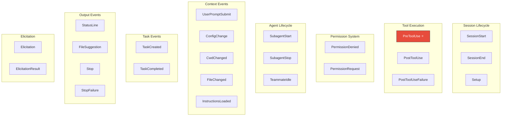
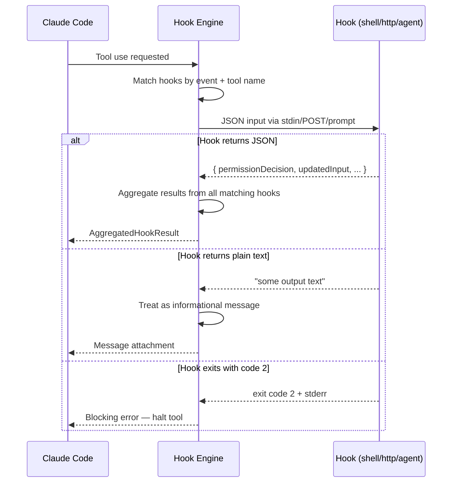

> 🌐 **Language**: English | [中文版 →](zh-CN/05-hook-system.md)

# Hook System: 20 Event Types, Full Lifecycle Interception

> **Source files**: `utils/hooks.ts` (5,023 lines), `utils/hooks/` directory, `hooks/` top-level (17,931 lines)

## TL;DR

Claude Code has a 20-event hook system that lets users and plugins intercept nearly every action — from tool execution to session lifecycle to permission decisions. Hooks can approve, deny, modify inputs, inject context, or stop the entire session. The main implementation file (`hooks.ts`) is **5,023 lines** — larger than most entire applications.

---

## 1. The 20 Hook Events



### Most Important Hook: PreToolUse

`PreToolUse` fires before every tool execution. It can:

| Action | JSON Output | Effect |
|--------|-------------|--------|
| **Allow** | `{ "permissionDecision": "allow" }` | Skip permission prompt, auto-approve |
| **Deny** | `{ "permissionDecision": "deny" }` | Block the tool, return error to model |
| **Ask** | `{ "permissionDecision": "ask" }` | Force permission prompt |
| **Modify input** | `{ "updatedInput": {...} }` | Change tool arguments before execution |
| **Stop session** | `{ "continue": false }` | Halt the entire agent loop |

---

## 2. Hook Execution Architecture

### Hook Types

Hooks can be implemented in three ways:

```typescript
// 1. Command hooks — shell scripts
{ "type": "command", "command": "python validate.py" }

// 2. HTTP hooks — webhook endpoints
{ "type": "http", "url": "https://api.example.com/hook" }

// 3. Agent hooks — Claude sub-agents as hooks
{ "type": "agent", "agent": "security-reviewer" }

// 4. Function hooks — in-process JavaScript (SDK only)
{ "type": "function", "callback": async (input) => {...} }
```

### Execution Flow



### Exit Code Convention

| Exit Code | Meaning |
|-----------|---------|
| 0 | Success — proceed normally |
| 1 | Non-blocking error — log and continue |
| **2** | **Blocking error — stop the tool** |
| Other | Treated as non-blocking error |

---

## 3. Hook Matching

Hooks declare which events and tools they intercept:

```json
{
  "hooks": {
    "PreToolUse": [
      {
        "matcher": "Bash(git *)",
        "command": "python validate_git.py"
      },
      {
        "matcher": "FileWrite",
        "command": "node check_readonly.js"
      }
    ]
  }
}
```

The matcher supports:
- **Tool name only**: `"Bash"` — matches all Bash commands
- **Tool + pattern**: `"Bash(git *)"` — matches Bash commands starting with `git`
- **Wildcard**: `"*"` — matches all tools

### Permission Matcher Pipeline

```typescript
// Each tool implements preparePermissionMatcher()
// This creates a closure that tests patterns against tool input
tool.preparePermissionMatcher(input)
// Returns: (pattern: string) => boolean
// e.g., for Bash: checks if command matches "git *"
```

---

## 4. Hook JSON Protocol

Hooks communicate via a structured JSON protocol:

### Input (stdin / POST body)

```json
{
  "session_id": "uuid",
  "transcript_path": "/path/to/transcript.json",
  "cwd": "/project",
  "tool_name": "Bash",
  "tool_input": { "command": "git push" },
  "permission_mode": "default",
  "agent_id": "optional-agent-id"
}
```

### Output (stdout / response body)

```json
{
  "continue": true,
  "decision": "approve",
  "reason": "Git operations are safe",
  "systemMessage": "Optional message to inject",
  "hookSpecificOutput": {
    "hookEventName": "PreToolUse",
    "permissionDecision": "allow",
    "updatedInput": { "command": "git push --no-verify" },
    "additionalContext": "Note: --no-verify was added"
  }
}
```

The output schema is validated with Zod (`hookJSONOutputSchema`). Invalid JSON is treated as plain text.

---

## 5. Workspace Trust Security

A critical security mechanism prevents hooks from running in untrusted workspaces:

```typescript
export function shouldSkipHookDueToTrust(): boolean {
  const isInteractive = !getIsNonInteractiveSession()
  if (!isInteractive) return false  // SDK mode: trust is implicit

  // ALL hooks require workspace trust in interactive mode
  return !checkHasTrustDialogAccepted()
}
```

This prevents a malicious `.claude/settings.json` in a cloned repo from executing arbitrary commands when a user opens the project.

---

## 6. Async Hook Execution

Hooks can run asynchronously in the background:

```typescript
// AsyncHookJSONOutput declares the hook wants background execution
{ "async": true, "asyncRewake": true }

// The hook is registered and continues running
registerPendingAsyncHook({
  processId, hookId, shellCommand, ...
})

// When it completes, it can re-wake the model
// via task-notification message
```

`asyncRewake` hooks can inject results back into the conversation after completion — even if the model has moved on to other tasks.

---

## 7. Hook Aggregation

When multiple hooks match the same event, their results are aggregated:

```typescript
// Aggregation rules:
// - Any "deny" → deny (most restrictive wins)
// - Any "blocking" → stop
// - Multiple "additionalContext" → concatenated
// - Multiple "updatedInput" → last one wins
// - "preventContinuation" → any true stops the session
```

This means a plugin's security hook can block an operation even if another plugin's hook approved it.

---

## 8. Design Patterns Worth Stealing

### Pattern 1: Exit Code as Control Flow

Using exit codes (0/1/2) for success/warn/block is simple, universal, and works across any language — Python, Bash, Node, Go. No SDK needed.

### Pattern 2: JSON-or-Text Output

Hooks can return either structured JSON or plain text. JSON gets validated and parsed into decisions; plain text becomes an informational message. This makes simple hooks trivial (echo a message) while allowing sophisticated hooks to control permissions.

### Pattern 3: Matcher Closures

The `preparePermissionMatcher()` pattern pre-compiles the matching logic once, then calls the closure per pattern. This avoids re-parsing tool inputs for every hook rule.

---

## Summary

| Aspect | Detail |
|--------|--------|
| **Total code** | 5,023 lines in `hooks.ts` + 17,931 lines in `hooks/` directory |
| **Event types** | 20 lifecycle events |
| **Hook types** | Command (shell), HTTP (webhook), Agent (sub-agent), Function (SDK) |
| **Key hook** | `PreToolUse` — can approve/deny/modify any tool call |
| **Communication** | JSON via stdin/stdout, validated with Zod |
| **Security** | Workspace trust required, managed hooks only option |
| **Async** | Background execution with re-wake capability |
| **Aggregation** | Most restrictive wins (deny > allow) |
