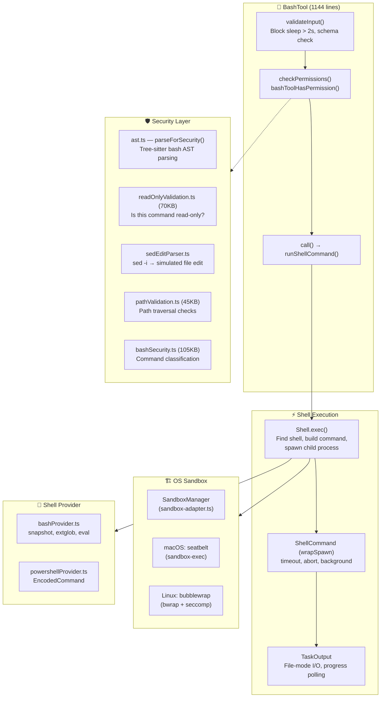
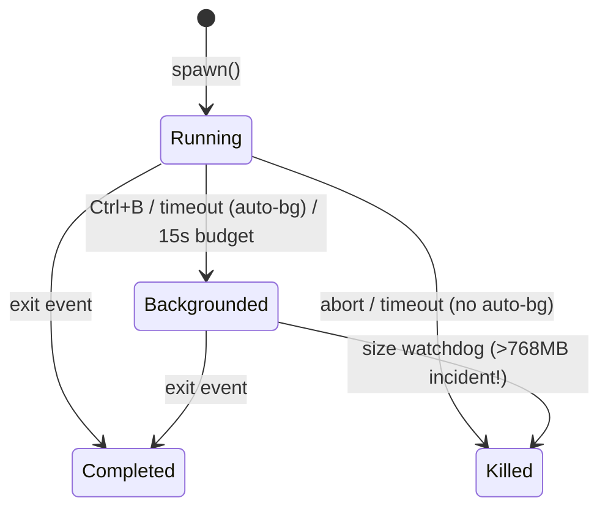
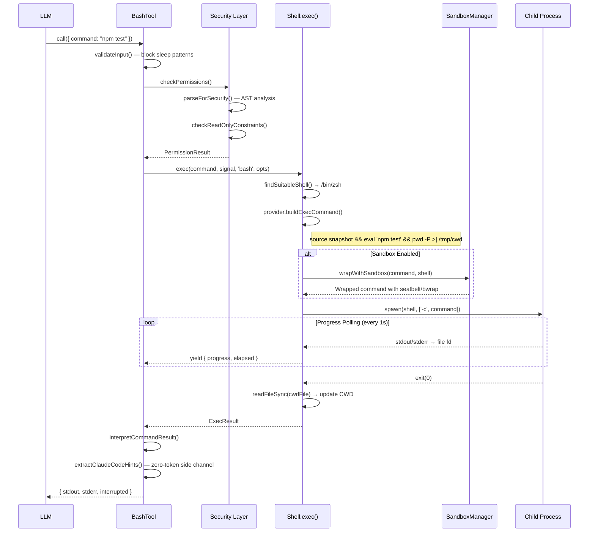

# 06 — Bash Execution Engine: Sandboxes, Pipelines & Process Lifecycle

> **Scope**: `tools/BashTool/` (18 files, ~580KB), `utils/Shell.ts`, `utils/ShellCommand.ts`, `utils/bash/` (15 files, ~430KB), `utils/sandbox/` (2 files, ~37KB), `utils/shell/` (10 files, ~114KB)
>
> **One-liner**: How Claude Code safely executes arbitrary shell commands — from parsing `ls && rm -rf /` to OS-level sandboxing — without losing sleep.

---

## Architecture Overview



---

## 1. BashTool: The Outer Shell (Pun Intended)

The entry point is `BashTool.tsx` — a 1144-line tool definition built with the standard `buildTool()` pattern. Its input schema is deceptively simple:

```typescript
z.strictObject({
  command: z.string(),
  timeout: semanticNumber(z.number().optional()),
  description: z.string().optional(),
  run_in_background: semanticBoolean(z.boolean().optional()),
  dangerouslyDisableSandbox: semanticBoolean(z.boolean().optional()),
  _simulatedSedEdit: z.object({...}).optional()  // HIDDEN from model
})
```

### The Hidden `_simulatedSedEdit` Field

This is a security-critical design: `_simulatedSedEdit` is **always omitted from the model-facing schema**. It's set internally by the permission dialog after a user approves a sed edit preview. If exposed, the model could bypass permission checks by pairing an innocuous command with an arbitrary file write.

### Command Classification

Before any command runs, BashTool classifies it for UI purposes:

```typescript
// Search commands → collapsible display
const BASH_SEARCH_COMMANDS = new Set(['find', 'grep', 'rg', 'ag', ...])

// Read commands → collapsible display  
const BASH_READ_COMMANDS = new Set(['cat', 'head', 'tail', 'jq', 'awk', ...])

// Semantic-neutral → skipped in classification
const BASH_SEMANTIC_NEUTRAL_COMMANDS = new Set(['echo', 'printf', 'true', ...])

// Silent commands → show "Done" instead of "(No output)"
const BASH_SILENT_COMMANDS = new Set(['mv', 'cp', 'rm', 'mkdir', ...])
```

For compound commands (`ls && echo "---" && ls dir2`), **all** parts must be search/read for the whole command to be collapsible. Semantic-neutral commands are transparent.

---

## 2. The `runShellCommand()` Generator

The heart of execution is an **AsyncGenerator** — a design that elegantly unifies progress reporting with command completion:

```typescript
async function* runShellCommand({
  input, abortController, setAppState, ...
}): AsyncGenerator<ProgressUpdate, ExecResult, void> {
  
  // 1. Determine if auto-backgrounding is allowed
  const shouldAutoBackground = !isBackgroundTasksDisabled 
    && isAutobackgroundingAllowed(command)
  
  // 2. Execute via Shell.exec()
  const shellCommand = await exec(command, signal, 'bash', {
    timeout: timeoutMs,
    onProgress(lastLines, allLines, totalLines, totalBytes) {
      // Wake the generator to yield progress
      resolveProgress?.()
    },
    shouldUseSandbox: shouldUseSandbox(input),
    shouldAutoBackground
  })
  
  // 3. Wait for initial threshold (2s) before showing progress
  const initialResult = await Promise.race([
    resultPromise,
    new Promise(r => setTimeout(r, PROGRESS_THRESHOLD_MS))
  ])
  if (initialResult !== null) return initialResult  // Fast command

  // 4. Progress loop driven by shared poller
  TaskOutput.startPolling(shellCommand.taskOutput.taskId)
  while (true) {
    const result = await Promise.race([resultPromise, progressSignal])
    if (result !== null) return result
    if (backgroundShellId) return backgroundResult
    yield { type: 'progress', output, elapsedTimeSeconds, ... }
  }
}
```

### The Three Backgrounding Paths

| Path | Trigger | Who Decides |
|------|---------|-------------|
| **Explicit** | `run_in_background: true` | The model |
| **Timeout** | Command exceeds default timeout | `shellCommand.onTimeout()` |
| **Assistant-mode** | Blocking > 15s in main agent | `setTimeout()` with `ASSISTANT_BLOCKING_BUDGET_MS` |
| **User** | Ctrl+B during execution | `registerForeground()` → `background()` |

The `sleep` command is specifically blocked from auto-backgrounding — it runs in foreground unless explicitly backgrounded.

---

## 3. Shell Execution Layer (`Shell.ts`)

### Shell Discovery

Claude Code is opinionated about which shells it supports:

```typescript
export async function findSuitableShell(): Promise<string> {
  // 1. Check CLAUDE_CODE_SHELL override (must be bash or zsh)
  // 2. Check $SHELL (must be bash or zsh)
  // 3. Probe: which zsh, which bash
  // 4. Search fallback paths: /bin, /usr/bin, /usr/local/bin, /opt/homebrew/bin
  // 5. Order by user preference (SHELL=bash → bash first)
}
```

**Only bash and zsh are supported**. Fish, dash, csh — all rejected. The comment is blunt: *"if we ever want to add support for new shells we'll need to update our Bash tool parsing."*

### Process Spawning: File Mode vs. Pipe Mode

A critical architectural decision drives I/O performance:

**File Mode (default for bash commands)**:
```typescript
// Both stdout AND stderr go to the SAME file fd
const outputHandle = await open(taskOutput.path,
  process.platform === 'win32' ? 'w' :
    O_WRONLY | O_CREAT | O_APPEND | O_NOFOLLOW  // SECURITY: anti-symlink
)

spawn(shell, args, {
  stdio: ['pipe', outputHandle.fd, outputHandle.fd],  // merged fd!
  detached: true,
  windowsHide: true
})
```

This means **stderr is interleaved with stdout chronologically** — no separate stderr handling. The code comments explain the `O_APPEND` atomicity guarantee on POSIX ("seek-to-end + write") and the Windows workaround (`'w'` mode because `'a'` strips `FILE_WRITE_DATA`, causing MSYS2/Cygwin to silently discard all output).

**Pipe Mode (for hooks/callbacks)**:
```typescript
spawn(shell, args, {
  stdio: ['pipe', 'pipe', 'pipe']
})
// StreamWrapper instances funnel data through TaskOutput
```

### CWD Tracking

Each command ends with `pwd -P >| /tmp/claude-XXXX-cwd`. After the child exits, a **synchronous** `readFileSync` updates the CWD:

```typescript
void shellCommand.result.then(async result => {
  if (!preventCwdChanges && !result.backgroundTaskId) {
    let newCwd = readFileSync(cwdFilePath, 'utf8').trim()
    if (newCwd.normalize('NFC') !== cwd) {  // Unicode normalization!
      setCwd(newCwd, cwd)
      invalidateSessionEnvCache()
      void onCwdChangedForHooks(cwd, newCwd)
    }
  }
})
```

The NFC normalization handles macOS APFS which stores paths as NFD — without it, Unicode paths would falsely trigger a "changed" event on every command.

---

## 4. ShellCommand: The Process Wrapper

`ShellCommand.ts` wraps each `child_process.spawn()` with lifecycle management:



### The Size Watchdog

Background tasks write directly to a file fd with **no JS involvement**. A stuck append loop once filled 768GB of disk. The fix:

```typescript
#startSizeWatchdog(): void {
  this.#sizeWatchdog = setInterval(() => {
    void stat(this.taskOutput.path).then(s => {
      if (s.size > this.#maxOutputBytes && this.#status === 'backgrounded') {
        this.#killedForSize = true
        this.#doKill(SIGKILL)
      }
    })
  }, SIZE_WATCHDOG_INTERVAL_MS)  // 5 seconds
}
```

### Why `exit` Not `close`

The code uses `'exit'` instead of `'close'` to detect child termination:

> *`close` waits for stdio to close, which includes grandchild processes that inherit file descriptors (e.g. `sleep 30 &`). `exit` fires when the shell itself exits, returning control immediately.*

Process termination uses `tree-kill` with `SIGKILL` — no gentle `SIGTERM` grace period. The entire process tree gets killed.

---

## 5. Bash Provider: The Command Assembly Line

`bashProvider.ts` builds the actual command string that gets passed to the shell:

```
source /tmp/snapshot.sh 2>/dev/null || true
&& eval '<quoted-user-command>'
&& pwd -P >| /tmp/claude-XXXX-cwd
```

### Shell Snapshot

Before the first command, `createAndSaveSnapshot()` captures the user's shell environment (PATH, aliases, functions) into a temp file. Subsequent commands `source` this snapshot instead of running full login shell initialization (`-l` flag is skipped).

If the snapshot file vanishes mid-session (tmpdir cleanup), the provider falls back to `-l` mode automatically:

```typescript
if (snapshotFilePath) {
  try { await access(snapshotFilePath) }
  catch { snapshotFilePath = undefined }  // Fallback to login shell
}
```

### ExtGlob Security

Extended glob patterns (`bash extglob`, `zsh EXTENDED_GLOB`) are **disabled** before every command:

```bash
shopt -u extglob 2>/dev/null || true   # bash
setopt NO_EXTENDED_GLOB 2>/dev/null     # zsh
```

Why? Malicious filenames containing glob patterns could expand *after* security validation but *before* execution.

### The `eval` Wrapper

User commands are wrapped in `eval '<command>'` to enable a second parsing pass where aliases (loaded from the snapshot) are available for expansion.

---

## 6. OS-Level Sandboxing

`sandbox-adapter.ts` (986 lines) bridges Claude Code's settings system with `@anthropic-ai/sandbox-runtime`:

### Platform Support

| Platform | Technology | Notes |
|----------|-----------|-------|
| **macOS** | `sandbox-exec` (seatbelt) | Profile-based, glob-aware |
| **Linux** | `bubblewrap` (bwrap) + seccomp | Namespace isolation, **no glob support** |
| **WSL2** | bubblewrap | Supported since WSL2 |
| **WSL1** | ❌ | Not supported |
| **Windows** | ❌ | Not supported (PowerShell sandboxing uses different path) |

### Config Conversion

Settings are converted to `SandboxRuntimeConfig`:

```typescript
function convertToSandboxRuntimeConfig(settings): SandboxRuntimeConfig {
  // 1. Extract network domains from WebFetch permission rules
  // 2. Extract filesystem paths from Edit/Read rules
  // 3. Always deny writes to settings.json (sandbox escape prevention!)
  // 4. Always deny writes to .claude/skills (same privilege as commands)
  // 5. Block bare-git-repo attack vectors (HEAD, objects, refs, hooks, config)
  // 6. Detect git worktrees → allow writes to main repo
  // 7. Include --add-dir directories in allowWrite
  // 8. Configure ripgrep path for sandbox-internal grep
}
```

### Security: Settings File Protection

The sandbox **unconditionally denies writes** to settings files:

```typescript
const settingsPaths = SETTING_SOURCES.map(source =>
  getSettingsFilePathForSource(source)
).filter(p => p !== undefined)
denyWrite.push(...settingsPaths)
denyWrite.push(getManagedSettingsDropInDir())
```

This prevents a sandboxed command from modifying its own sandbox rules — a classic sandbox escape vector.

### The Bare Git Repo Attack

A fascinating security measure blocks an attack where a sandboxed process plants files (`HEAD`, `objects/`, `refs/`) to make the working directory look like a bare git repo. When Claude's *unsandboxed* git later runs, `is_git_directory()` returns true, and a malicious `config` with `core.fsmonitor` escapes the sandbox:

```typescript
const bareGitRepoFiles = ['HEAD', 'objects', 'refs', 'hooks', 'config']
for (const gitFile of bareGitRepoFiles) {
  const p = resolve(dir, gitFile)
  try {
    statSync(p)        // File exists → deny writes (ro-bind)
    denyWrite.push(p)
  } catch {
    bareGitRepoScrubPaths.push(p)  // Doesn't exist → scrub after command
  }
}
```

Post-command, `scrubBareGitRepoFiles()` removes any planted files before unsandboxed git can see them.

---

## 7. Complete Execution Flow



---

## 8. Design Insights

### Why Merge stdout and stderr?

By piping both to the same file fd, Claude Code avoids the classic race condition where stdout and stderr from concurrent writes arrive out of order. The comments explain: *"On POSIX, O_APPEND makes each write atomic (seek-to-end + write), so stdout and stderr are interleaved chronologically without tearing."*

### The Claude Code Hints Protocol

When commands run with `CLAUDECODE=1` in the environment, CLIs/SDKs can emit a `<claude-code-hint />` tag to stderr. BashTool scans for these, records them for plugin hint recommendations, then **strips them** so the model never sees the tag — a **zero-token side channel**:

```typescript
const extracted = extractClaudeCodeHints(strippedStdout, input.command)
strippedStdout = extracted.stripped  // Model sees clean output
if (isMainThread && extracted.hints.length > 0) {
  for (const hint of extracted.hints) maybeRecordPluginHint(hint)
}
```

### AsyncGenerator for Progress: Elegant Simplicity

The `runShellCommand()` generator pattern is worth studying. Instead of callbacks, event emitters, or rxjs observables, a simple `yield` in a `while(true)` loop produces progress updates. The caller consumes them with a standard `do/while + .next()` loop. The `Promise.race([resultPromise, progressSignal])` pattern cleanly handles both completion and progress in a single await.

---

## Summary

| Component | Lines | Role |
|----------|-------|------|
| `BashTool.tsx` | 1,144 | Tool definition, input/output schema, classification |
| `bashPermissions.ts` | ~2,500 | Permission matching with wildcard patterns |
| `bashSecurity.ts` | ~2,600 | Command security classification |
| `readOnlyValidation.ts` | ~1,700 | Read-only constraint checking |
| `pathValidation.ts` | ~1,100 | Path traversal and escape detection |
| `Shell.ts` | 475 | Shell discovery, process spawning, CWD tracking |
| `ShellCommand.ts` | 466 | Process lifecycle, backgrounding, timeouts |
| `sandbox-adapter.ts` | 986 | Settings conversion, OS sandbox orchestration |
| `bashProvider.ts` | 256 | Command assembly, snapshots, eval wrapping |
| `bash/` parsers | ~7,000+ | AST parsing, heredoc, quoting, pipe handling |

The Bash execution engine is Claude Code's most security-sensitive subsystem. It demonstrates a **defense-in-depth** approach: application-level command parsing → permission rules → sandbox wrapping → OS-level kernel enforcement. Each layer independently prevents different classes of attacks, and the system degrades gracefully when individual layers are unavailable.

---

**Next**: [07 — Permission Pipeline →](07-permission-pipeline.md)

**Previous**: [← 05 — Hook System](05-hook-system.md)
