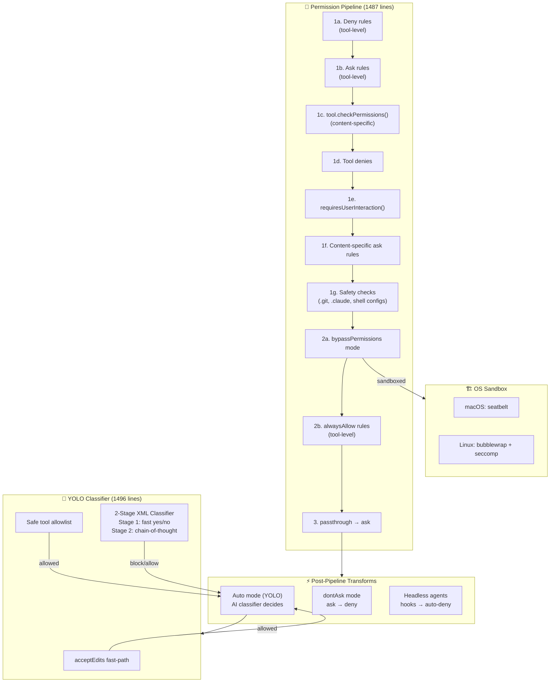
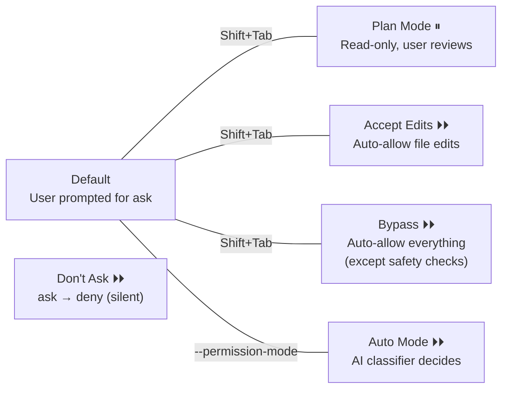
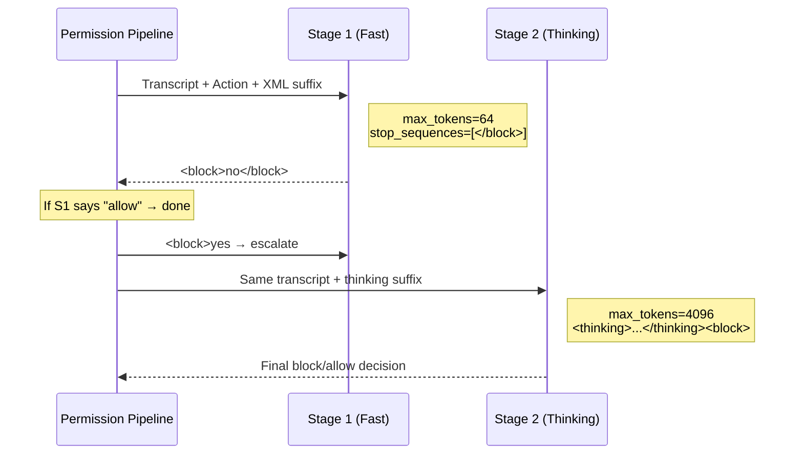
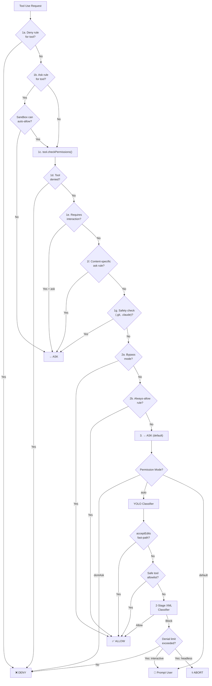

# 07 — Permission Pipeline: Defense-in-Depth from Rules to Kernel

> **Scope**: `utils/permissions/` (24 files, ~320KB), `utils/settings/` (17 files, ~135KB), `utils/sandbox/` (2 files, ~37KB)
>
> **One-liner**: How Claude Code decides whether a tool call lives or dies — through a seven-step gauntlet of rules, classifiers, hooks, and OS-level sandbox enforcement.

---

## Architecture Overview



---

## 1. The Seven-Step Gauntlet

The core function `hasPermissionsToUseToolInner()` implements a **strictly ordered** permission evaluation pipeline. Each step can short-circuit the entire chain:

### Step 1a: Tool-Level Deny Rules

```typescript
const denyRule = getDenyRuleForTool(appState.toolPermissionContext, tool)
if (denyRule) return { behavior: 'deny', ... }
```

Hard deny — no override possible. Sourced from: `userSettings`, `projectSettings`, `localSettings`, `policySettings`, `flagSettings`, `cliArg`, `command`, `session`.

### Step 1b: Tool-Level Ask Rules

```typescript
const askRule = getAskRuleForTool(appState.toolPermissionContext, tool)
if (askRule) {
  // Exception: sandbox can auto-allow Bash commands
  const canSandboxAutoAllow =
    tool.name === 'Bash' &&
    SandboxManager.isSandboxingEnabled() &&
    SandboxManager.isAutoAllowBashIfSandboxedEnabled() &&
    shouldUseSandbox(input)
  if (!canSandboxAutoAllow) return { behavior: 'ask', ... }
}
```

Critical design: when sandbox is enabled with auto-allow, sandboxed Bash commands **skip** the ask rule. Non-sandboxed commands (excluded commands, `dangerouslyDisableSandbox`) still respect it.

### Step 1c: Tool-Specific Permission Check

```typescript
const parsedInput = tool.inputSchema.parse(input)
toolPermissionResult = await tool.checkPermissions(parsedInput, context)
```

Each tool implements its own `checkPermissions()`. BashTool inspects subcommands, EditTool checks file paths, WebFetch validates domains.

### Step 1d–1g: Safety Guardrails

| Step | Check | Immune to Bypass? |
|------|-------|-------------------|
| **1d** | Tool implementation denied | ✅ Yes |
| **1e** | `requiresUserInteraction()` returns true | ✅ Yes |
| **1f** | Content-specific ask rules (e.g., `Bash(npm publish:*)`) | ✅ Yes |
| **1g** | Safety checks (`.git/`, `.claude/`, `.vscode/`, shell configs) | ✅ Yes |

These four checks are **bypass-immune** — they fire even in `bypassPermissions` mode.

### Step 2a: Bypass Permissions Mode

```typescript
const shouldBypassPermissions =
  mode === 'bypassPermissions' ||
  (mode === 'plan' && isBypassPermissionsModeAvailable)
if (shouldBypassPermissions) return { behavior: 'allow', ... }
```

### Step 2b: Always-Allow Rules

```typescript
const alwaysAllowedRule = toolAlwaysAllowedRule(context, tool)
if (alwaysAllowedRule) return { behavior: 'allow', ... }
```

Supports MCP server-level matching: rule `mcp__server1` matches `mcp__server1__tool1`.

### Step 3: Passthrough → Ask

```typescript
const result = toolPermissionResult.behavior === 'passthrough'
  ? { ...toolPermissionResult, behavior: 'ask' }
  : toolPermissionResult
```

If nothing decided, the default is to ask the user.

---

## 2. Permission Modes

Six modes control how `ask` decisions are resolved:



### Mode Behavior Matrix

| Mode | `ask` becomes | Safety checks | Notes |
|------|--------------|---------------|-------|
| `default` | Prompt user | Prompt | Standard interactive mode |
| `plan` | Prompt user | Prompt | Stashes pre-plan mode for restoration |
| `acceptEdits` | Allow (file edits only) | Prompt | Non-edit tools still prompt |
| `bypassPermissions` | Allow all | **Still prompt** | Can be disabled by GrowthBook gate or settings |
| `dontAsk` | **Deny** | Prompt | Silent rejection, model sees denial message |
| `auto` | Classifier decides | Prompt | 2-stage XML classifier, GrowthBook-gated |

### Mode Transitions

`transitionPermissionMode()` centralizes all side-effects:

- **Entering auto mode**: Strips dangerous permissions (Bash(*), python:*, Agent allowlists) that would bypass the classifier
- **Leaving auto mode**: Restores stripped permissions
- **Entering plan mode**: Saves pre-plan mode for restoration
- **Leaving plan mode**: Restores previous mode

---

## 3. Rule Sources and Priority

Rules are loaded from **7 sources**, evaluated in a flat list:

```typescript
const PERMISSION_RULE_SOURCES = [
  ...SETTING_SOURCES,  // userSettings, projectSettings, localSettings,
                       // policySettings, flagSettings
  'cliArg',
  'command',
  'session',
]
```

### Rule Format

```
ToolName                  → Match entire tool
ToolName(content)         → Match tool with specific content
Bash(npm test:*)          → Prefix match on Bash commands
mcp__server1              → Match all tools from MCP server
mcp__server1__*           → Wildcard match for MCP tools
Agent(Explore)            → Match specific agent type
```

### Settings File Hierarchy

| Source | File | Scope |
|--------|------|-------|
| `userSettings` | `~/.claude/settings.json` | Per-user global |
| `projectSettings` | `.claude/settings.json` | Per-project, committed |
| `localSettings` | `.claude/settings.local.json` | Per-project, gitignored |
| `policySettings` | Enterprise MDM policies | Organization-wide |
| `flagSettings` | GrowthBook feature flags | Remote config |
| `cliArg` | `--allowed-tools`, `--disallowed-tools` | Per-invocation |
| `session` | Runtime additions via permission dialog | Per-session |

---

## 4. The YOLO Classifier (Auto Mode)

When mode is `auto`, `ask` decisions go through a **three-tier** fast-path system before reaching the AI classifier:

### Tier 1: acceptEdits Fast-Path

```typescript
// Re-run tool.checkPermissions() with mode='acceptEdits'
const acceptEditsResult = await tool.checkPermissions(parsedInput, {
  ...context,
  getAppState: () => ({
    ...state,
    toolPermissionContext: { ...state.toolPermissionContext, mode: 'acceptEdits' }
  })
})
if (acceptEditsResult.behavior === 'allow') return { behavior: 'allow' }
```

Avoids expensive classifier API calls for safe file edits. Exception: `AgentTool` and `REPLTool` are excluded — REPL code can contain VM escapes.

### Tier 2: Safe Tool Allowlist

```typescript
if (classifierDecisionModule.isAutoModeAllowlistedTool(tool.name)) {
  return { behavior: 'allow' }
}
```

Allowlisted tools skip the classifier entirely.

### Tier 3: 2-Stage XML Classifier

The classifier uses a separate LLM API call (`sideQuery`) with a specialized system prompt:



**Stage 1 (Fast)**: Nudges an immediate `<block>yes/no` decision with 64 max tokens. If allowed → done.

**Stage 2 (Thinking)**: Only runs when Stage 1 blocks. Uses chain-of-thought to reduce false positives. The suffix instructs: *"Review the classification process... explicit user confirmation is required to override blocks."*

### Classifier Transcript Format

The classifier sees a **compact transcript** — not the full conversation:

```jsonl
{"user":"fix the login bug"}
{"Bash":"ls src/"}
{"Read":"src/auth.ts"}
{"Bash":"npm test"}     ← This is the action being classified
```

Key security: **assistant text is excluded** — only tool_use blocks are included. This prevents the model from crafting text that influences the classifier's decision.

### Dangerous Permission Stripping

When entering auto mode, permissions that would bypass the classifier are **stripped**:

```typescript
function isDangerousBashPermission(toolName, ruleContent): boolean {
  // Bash (no content) → allows ALL commands
  // Bash(python:*) → allows arbitrary code execution
  // Bash(node:*), Bash(ruby:*), etc.
  // PowerShell(iex:*), PowerShell(Start-Process:*)
  // Agent (any allow rule) → bypasses sub-agent evaluation
}
```

Stripped rules are **stashed** and restored when leaving auto mode.

---

## 5. Denial Tracking and Circuit Breakers

### Consecutive Denial Limits

```typescript
export const DENIAL_LIMITS = {
  maxConsecutive: 3,   // 3 consecutive blocks → fall back to prompting
  maxTotal: 20,        // 20 total blocks per session → fall back
}
```

When limits are exceeded:
- **Interactive mode**: Falls back to user prompting
- **Headless mode**: Throws `AbortError` — session terminates

### Classifier Fail Modes

| Scenario | tengu_iron_gate_closed = true | tengu_iron_gate_closed = false |
|----------|------|------|
| **API error** | Deny (fail closed) | Fall back to prompting (fail open) |
| **Transcript too long** | Abort in headless; prompt in interactive | Same |
| **Unparseable response** | Treat as block | Same |

### The "Iron Gate" Feature Flag

`tengu_iron_gate_closed` controls fail-closed vs. fail-open behavior when the classifier API is unavailable. Refreshed every 30 minutes:

```typescript
const CLASSIFIER_FAIL_CLOSED_REFRESH_MS = 30 * 60 * 1000
```

---

## 6. Headless Agent Permissions

Background/async agents can't show permission prompts. The pipeline handles this:

```typescript
if (appState.toolPermissionContext.shouldAvoidPermissionPrompts) {
  // 1. Run PermissionRequest hooks — give hooks a chance
  const hookDecision = await runPermissionRequestHooksForHeadlessAgent(...)
  if (hookDecision) return hookDecision

  // 2. No hook decision → auto-deny
  return { behavior: 'deny', message: AUTO_REJECT_MESSAGE(tool.name) }
}
```

Hooks can `allow` (with optional input modifications), `deny`, or `interrupt` (abort the entire agent).

---

## 7. Sandbox Integration

The sandbox provides **kernel-level enforcement** that complements the application-level permission pipeline:

### Auto-Allow with Sandbox

When `autoAllowBashIfSandboxed` is enabled:
1. Bash commands that pass `shouldUseSandbox()` check → **auto-allow** (skip ask rule)
2. The OS sandbox enforces filesystem and network restrictions
3. Application-level checks become redundant for sandboxed operations

### What the Sandbox Protects

| Protection | Implementation |
|-----------|---------------|
| Filesystem writes | `denyWrite` list (settings files, `.claude/skills`) |
| Filesystem reads | `denyRead` list (sensitive paths) |
| Network access | Domain allowlist from WebFetch rules |
| Bare git repo attack | Pre/post-command file scrubbing |
| Symlink following | `O_NOFOLLOW` on file operations |
| Settings escape | Unconditional deny on settings.json |

---

## 8. Complete Decision Flow



---

## 9. Design Insights

### Why Seven Steps, Not Three?

The pipeline's granularity exists because different callers (rules, tools, safety checks) need different bypass behavior:

- **Deny rules** (1a): Never overridable
- **Ask rules** (1b): Overridable by sandbox
- **Tool checks** (1c): Overridable by bypass mode
- **Safety checks** (1g): Never overridable, even by bypass

A simpler "deny/allow/ask" model couldn't express "this should prompt even when the user said bypass everything."

### The Classifier Sees Tools, Not Text

By stripping assistant text from the transcript and only including tool_use blocks, the classifier is immune to social engineering attacks where the model crafts persuasive text to influence its own permission checks.

### Permission Stripping Is Reversible

When entering auto mode, dangerous permissions (like `Bash(*)`) are stripped and stashed. When leaving, they're restored. This means auto mode is a safe experiment — users can try it without permanently losing their allow rules.

### Denial Tracking Prevents Infinite Loops

Without denial limits (3 consecutive, 20 total), a blocked action could cause the model to retry endlessly. The circuit breaker ensures either human intervention (interactive) or clean shutdown (headless).

---

## Summary

| Component | Lines | Role |
|----------|-------|------|
| `permissions.ts` | 1,487 | Core pipeline: 7-step evaluation, mode transforms |
| `permissionSetup.ts` | 1,533 | Mode initialization, dangerous permission detection |
| `yoloClassifier.ts` | 1,496 | 2-stage XML classifier for auto mode |
| `PermissionMode.ts` | 142 | 6 permission modes + config |
| `PermissionRule.ts` | 41 | Rule type: `{toolName, ruleContent?}` |
| `denialTracking.ts` | 46 | Circuit breakers: 3 consecutive / 20 total |
| `permissionRuleParser.ts` | ~200 | Rule string ↔ structured value conversion |
| `permissionsLoader.ts` | ~250 | Load rules from 7 settings sources |
| `shadowedRuleDetection.ts` | ~250 | Detect rules that shadow/conflict |
| `sandbox-adapter.ts` | 986 | OS sandbox: seatbelt / bubblewrap |

The permission pipeline is Claude Code's most architecturally sophisticated subsystem. Its seven-step evaluation order — with four bypass-immune safety checks — represents hard-won lessons about what happens when AI agents can execute arbitrary code. The addition of the YOLO classifier shows the system evolving from pure rule-matching toward AI-assisted security decisions, while maintaining deterministic guardrails as a safety net.

---

**Previous**: [← 06 — Bash Execution Engine](06-bash-engine.md)
