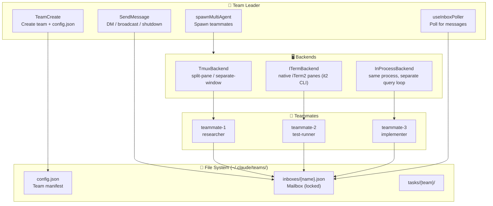
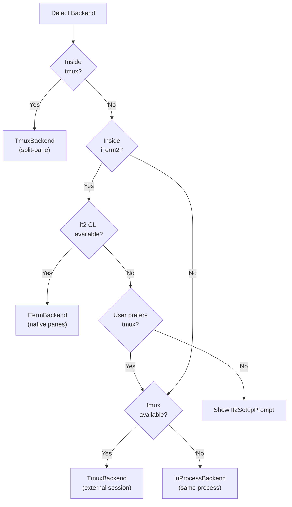

# 08 — Agent Swarms: Multi-Agent Team Coordination

> **Scope**: `tools/TeamCreateTool/`, `tools/SendMessageTool/`, `tools/shared/spawnMultiAgent.ts`, `utils/swarm/` (~30 files, ~6.8K lines), `utils/teammateMailbox.ts` (1,184 lines)
>
> **One-liner**: How Claude Code spawns parallel teammates across tmux panes, iTerm2 splits, or in-process — all coordinated through a file-based mailbox system with lockfile concurrency control.

---

## Architecture Overview



---

## 1. Team Lifecycle

### Creating a Team

`TeamCreateTool` initializes the team infrastructure:

1. Generate unique team name (word-slug if collision)
2. Create team leader entry with deterministic agent ID: `team-lead@{teamName}`
3. Write `config.json` to `~/.claude/teams/{team-name}/`
4. Register for session cleanup (auto-delete on exit if not explicitly deleted)
5. Reset task list directory for fresh task numbering

```typescript
// Team file structure
type TeamFile = {
  name: string
  description?: string
  createdAt: number
  leadAgentId: string          // "team-lead@my-project"
  leadSessionId?: string       // For team discovery
  teamAllowedPaths?: TeamAllowedPath[]  // Shared edit permissions
  members: Array<{
    agentId: string            // "researcher@my-project"
    name: string
    agentType?: string
    model?: string
    prompt?: string
    color?: string             // Unique color for UI identification
    planModeRequired?: boolean
    tmuxPaneId: string
    cwd: string
    worktreePath?: string      // Git worktree for isolation
    subscriptions: string[]
    backendType?: BackendType  // "tmux" | "iterm2" | "in-process"
    isActive?: boolean
    mode?: PermissionMode
  }>
}
```

### Spawning Teammates

`spawnMultiAgent.ts` (1,094 lines) handles the full spawn flow:

1. **Resolve model**: `inherit` → leader's model; `undefined` → hardcoded fallback
2. **Generate unique name**: Check existing members, append `-2`, `-3`, etc.
3. **Detect backend**: tmux > iTerm2 > in-process (see §3)
4. **Create pane/process**: Backend-specific spawn
5. **Build CLI args**: propagate `--agent-id`, `--team-name`, `--agent-color`, `--permission-mode`
6. **Register in team file**: Add member entry to `config.json`
7. **Send initial message**: Write prompt to teammate's mailbox
8. **Register background task**: For UI task pill display

---

## 2. The Mailbox System

The inter-agent communication backbone is a **file-based mailbox** with lockfile concurrency control.

### Directory Structure

```
~/.claude/teams/{team-name}/
├── config.json              # Team manifest
└── inboxes/
    ├── team-lead.json       # Leader's inbox
    ├── researcher.json      # Teammate inbox
    └── test-runner.json     # Teammate inbox
```

### Message Types

| Type | Direction | Purpose |
|------|----------|---------|
| Plain text DM | Any → Any | Direct messages |
| Broadcast (`to: "*"`) | Leader → All | Team-wide announcements |
| `idle_notification` | Worker → Leader | "I'm done / blocked / failed" |
| `permission_request` | Worker → Leader | Tool permission delegation |
| `permission_response` | Leader → Worker | Permission grant/deny |
| `sandbox_permission_request` | Worker → Leader | Network access approval |
| `plan_approval_request` | Worker → Leader | Plan review for `planModeRequired` |
| `shutdown_request` | Leader → Worker | Graceful shutdown |
| `shutdown_approved/rejected` | Worker → Leader | Shutdown confirmation |

### Concurrency Control

```typescript
const LOCK_OPTIONS = {
  retries: { retries: 10, minTimeout: 5, maxTimeout: 100 }
}
// Write with lock
release = await lockfile.lock(inboxPath, {
  lockfilePath: `${inboxPath}.lock`, ...LOCK_OPTIONS
})
const messages = await readMailbox(recipientName, teamName)
messages.push(newMessage)
await writeFile(inboxPath, jsonStringify(messages, null, 2))
release()
```

Multiple Claude instances in a swarm can write concurrently — the lockfile serializes access with exponential backoff retries.

---

## 3. Backend Detection and Execution

Three backends determine how teammates physically run:



### Backend Comparison

| Feature | Tmux | iTerm2 | In-Process |
|---------|------|--------|------------|
| Isolation | Separate process | Separate process | Same process, separate query loop |
| UI visibility | Pane with colored border | Native iTerm2 pane | Background task pill |
| Prerequisite | tmux installed | `it2` CLI installed | None |
| Non-interactive mode (`-p`) | ❌ | ❌ | ✅ (forced) |
| Socket isolation | PID-scoped: `claude-swarm-{pid}` | N/A | N/A |

### In-Process Fallback

When no pane backend is available (no tmux, no iTerm2), `markInProcessFallback()` is called and subsequent spawns skip detection entirely, running teammates as in-process query loops sharing the same Node.js process.

---

## 4. Permission Delegation

Teammates don't have interactive terminals — they delegate permission decisions to the leader:

### Permission Flow

1. Worker needs permission → creates `permission_request` message
2. Writes to leader's mailbox via `teammateMailbox.ts`
3. Leader's `useInboxPoller` picks up the request
4. Leader shows permission prompt to user
5. Leader sends `permission_response` back to worker's mailbox
6. Worker polls inbox, gets response, continues or aborts

### Plan Mode Required

Some teammates can be spawned with `plan_mode_required: true`:

- Teammate **must** enter plan mode and create a plan
- Plan is sent to leader as `plan_approval_request`
- Leader reviews and sends `plan_approval_response` with `approved: true/false`
- On approval, leader's permission mode is inherited (unless it's `plan`, which maps to `default`)

---

## 5. Agent Identity System

```typescript
// Deterministic agent ID format
function formatAgentId(name: string, teamName: string): string {
  return `${name}@${teamName}`  // "researcher@my-project"
}

// Leader is always
const TEAM_LEAD_NAME = 'team-lead'  // → "team-lead@my-project"
```

### CLI Flag Propagation

When spawning teammates, the leader propagates:

| Flag | Condition | Purpose |
|------|-----------|---------|
| `--dangerously-skip-permissions` | bypass mode + NOT planModeRequired | Inherit permission bypass |
| `--permission-mode auto` | auto mode | Inherit classifier |
| `--permission-mode acceptEdits` | acceptEdits mode | Inherit edit auto-allow |
| `--model {model}` | Explicit model override | Use leader's model |
| `--settings {path}` | CLI settings path | Share settings |
| `--plugin-dir {dir}` | Inline plugins | Share plugins |
| `--parent-session-id {id}` | Always | Lineage tracing |

---

## 6. Team Cleanup

### Graceful Shutdown

`SendMessage(type: shutdown_request)` → teammate responds `shutdown_approved/rejected`:

- **Approved**: In-process teammates abort their query loop; pane teammates call `gracefulShutdown(0)` via `setImmediate`
- **Rejected**: Teammate provides reason, continues working

### Session Cleanup

`cleanupSessionTeams()` runs on leader exit (registered with `gracefulShutdown`):

1. Kill orphaned teammate panes (still running after SIGINT)
2. Remove team directory: `~/.claude/teams/{team-name}/`
3. Remove task directory: `~/.claude/tasks/{team-name}/`
4. Destroy git worktrees for isolated teammates

---

## 7. Design Insights

### Why File-Based Mailboxes?

The mailbox system uses plain JSON files with lockfiles instead of IPC, WebSockets, or shared memory. This works because:

- **Cross-process**: tmux panes are separate processes with no shared memory
- **Crash-safe**: Messages persist on disk even if a teammate crashes
- **Debuggable**: `cat ~/.claude/teams/my-team/inboxes/researcher.json`
- **Simple**: No daemon, no port allocation, no service discovery

### The Backend Abstraction

The `TeammateExecutor` interface and `PaneBackend` abstraction mean the swarm system doesn't care *how* teammates run — only that they can receive initial prompts and exchange messages. Adding a new backend (e.g., Docker containers, SSH sessions) would only require implementing the `PaneBackend` interface.

### One Leader, Many Workers

The architecture enforces a strict leader-worker hierarchy:
- Only one team per leader session
- Workers cannot create teams or approve their own plans
- Shutdown is always leader-initiated, worker-approved
- Permission delegation always flows worker → leader → worker

---

## Summary

| Component | Lines | Role |
|----------|-------|------|
| `spawnMultiAgent.ts` | 1,094 | Unified teammate spawn logic |
| `teammateMailbox.ts` | 1,184 | File-based mailbox with lockfile concurrency |
| `teamHelpers.ts` | 684 | Team file CRUD, cleanup, worktree management |
| `SendMessageTool.ts` | 918 | DM, broadcast, shutdown, plan approval |
| `TeamCreateTool.ts` | 241 | Team initialization |
| `backends/registry.ts` | 465 | Backend detection: tmux > iTerm2 > in-process |
| `constants.ts` | 34 | Team names, session names, env vars |
| `teammateLayoutManager.ts` | ~400 | Pane creation, color assignment, border status |

The swarm system is Claude Code's most operationally complex feature — it combines process management, file-based IPC, terminal multiplexing, and distributed permission delegation into a cohesive multi-agent framework. The file-based mailbox design prioritizes simplicity and debuggability over performance, which is the right trade-off when your "distributed system" is multiple AI agents sharing a single filesystem.

---

**Previous**: [← 07 — Permission Pipeline](07-permission-pipeline.md)
**Next**: [→ 09 — Session Persistence](09-session-persistence.md)
