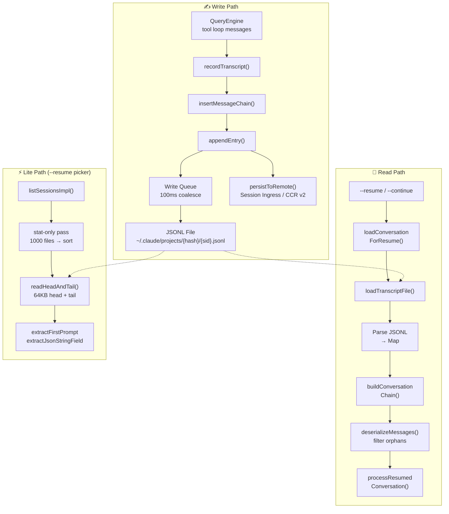

# 09 — Session Persistence: Conversation Storage & Resume

> **Scope**: `utils/sessionStorage.ts` (5,106 lines), `utils/sessionStoragePortable.ts` (794 lines), `utils/sessionRestore.ts` (552 lines), `utils/conversationRecovery.ts` (598 lines), `utils/listSessionsImpl.ts` (455 lines), `utils/crossProjectResume.ts` (76 lines) — ~7,600 lines total
>
> **One-liner**: How Claude Code persists every conversation turn, metadata entry, and subagent transcript to append-only JSONL files — and reconstructs them on `--resume` via parent-UUID chain walks.

---

## Architecture Overview



---

## 1. Storage Format: Append-Only JSONL

Every session produces a single JSONL file at:

```
~/.claude/projects/{sanitized-cwd}/{session-id}.jsonl
```

### Path Sanitization

`sanitizePath()` replaces all non-alphanumeric characters with hyphens. For paths exceeding 200 characters, a hash suffix is appended for uniqueness (Bun uses `Bun.hash`, Node falls back to `djb2Hash`).

### Entry Types

Each line is a self-contained JSON object with a `type` field:

| Type | Purpose |
|------|---------|
| `user` / `assistant` / `system` / `attachment` | Transcript messages (conversation chain) |
| `summary` | Compaction summaries |
| `custom-title` / `ai-title` | Session naming |
| `last-prompt` | Most recent user prompt (for `--resume` picker) |
| `tag` | User-defined session tags |
| `agent-name` / `agent-color` / `agent-setting` | Standalone agent context |
| `mode` | `coordinator` or `normal` |
| `worktree-state` | Git worktree enter/exit tracking |
| `pr-link` | GitHub PR association |
| `file-history-snapshot` | File change tracking |
| `attribution-snapshot` | Commit attribution state |
| `content-replacement` | Tool output compression records |
| `marble-origami-commit` / `marble-origami-snapshot` | Context collapse state |
| `queue-operation` | Message queue operations |

### Parent-UUID Chain

Transcript messages form a linked list via `parentUuid` → `uuid`:

```
msg-A (parentUuid: null)
  └── msg-B (parentUuid: A)
        └── msg-C (parentUuid: B)
              └── msg-D (parentUuid: C)
```

This enables branching (fork sessions share chain prefixes), side-chains (subagent transcripts), and compaction boundaries (null parentUuid truncates the chain).

---

## 2. The Project Singleton

`sessionStorage.ts` centers on a `Project` class — a process-lifetime singleton managing all write operations.

### Lazy Materialization

Session files aren't created at startup. They're materialized on the **first user or assistant message**:

1. Pre-message entries (hook output, attachments) are buffered in `pendingEntries[]`
2. `materializeSessionFile()` creates the file, writes cached metadata, flushes the buffer
3. This prevents orphan metadata-only files from startup-then-quit flows

### Dual Write Paths

The system has **two independent write mechanisms** for different contexts:

| Path | Method | When Used |
|------|--------|-----------|
| **Async queue** | `Project.enqueueWrite()` → `scheduleDrain()` → `drainWriteQueue()` | Normal runtime — all transcript messages |
| **Sync direct** | `appendEntryToFile()` → `appendFileSync()` | Exit cleanup, metadata re-append, `saveCustomTitle()` |

The async queue is the primary write path during normal operation:

```
Project.appendEntry() → enqueueWrite(filePath, entry)
                            │
                            ▼
                      scheduleDrain()
                            │
                            ▼ (100ms timer, or 10ms for CCR)
                      drainWriteQueue()
                            │
                            ▼
                      appendToFile() → fsAppendFile(path, data, { mode: 0o600 })
```

The sync path (`appendEntryToFile`) bypasses the queue entirely — it uses `appendFileSync` for scenarios where async scheduling isn't safe (process exit handlers, `reAppendSessionMetadata`).

Key design decisions:

- **Per-file queues**: `Map<string, Array<{entry, resolve}>>` — subagent transcripts go to separate files
- **100ms coalescing**: Batches rapid-fire writes into single `appendFile` calls
- **100MB chunk limit**: Prevents single `write()` syscalls from exceeding OS limits
- **Tracked writes**: `pendingWriteCount` + `flushResolvers` enable reliable `flush()` before shutdown

### UUID Deduplication

Before writing, `appendEntry()` checks if the UUID already exists in `getSessionMessages()`:

```typescript
const isNewUuid = !messageSet.has(entry.uuid)
if (isAgentSidechain || isNewUuid) {
  void this.enqueueWrite(targetFile, entry)
}
```

Agent sidechain entries bypass this check — they go to separate files, and fork-inherited parent messages share UUIDs with the main transcript.

---

## 3. Resume: From JSONL to Conversation

### The Resume Pipeline

```
loadConversationForResume(source)
  │
  ├── source === undefined  → loadMessageLogs() → most recent session
  ├── source === string     → getLastSessionLog(sessionId)
  └── source === .jsonl path → loadMessagesFromJsonlPath()
        │
        ▼
  loadTranscriptFile(path)
        │
        ▼
  readTranscriptForLoad(filePath, fileSize)    ← chunked read, strips attr-snaps
        │
        ▼
  parseJSONL → Map<UUID, TranscriptMessage>
        │
        ▼
  applyPreservedSegmentRelinks()    ← reconnect preserved segments after compaction
  applySnipRemovals()               ← delete snip-removed messages, relink chain
        │
        ▼
  findLatestMessage(leafUuids)      ← newest non-sidechain leaf
        │
        ▼
  buildConversationChain(messages, leaf)  ← walk parentUuid → root, reverse
        │
        ▼
  recoverOrphanedParallelToolResults()   ← re-splice parallel tool_use siblings
        │
        ▼
  deserializeMessagesWithInterruptDetection()
        │
        ├── filterUnresolvedToolUses()
        ├── filterOrphanedThinkingOnlyMessages()
        ├── filterWhitespaceOnlyAssistantMessages()
        ├── detectTurnInterruption()
        └── append synthetic continuation if interrupted
```

### Chain Walk

`buildConversationChain()` is the core traversal:

```typescript
let currentMsg = leafMessage
while (currentMsg) {
  if (seen.has(currentMsg.uuid)) break  // cycle detection
  seen.add(currentMsg.uuid)
  transcript.push(currentMsg)
  currentMsg = currentMsg.parentUuid
    ? messages.get(currentMsg.parentUuid)
    : undefined
}
transcript.reverse()
```

This walks from leaf to root, then reverses — producing the conversation in chronological order. The `seen` set prevents infinite loops from corrupted chain pointers.

### Resume Consistency Check

After chain reconstruction, `checkResumeConsistency()` compares the chain length against the last `turn_duration` checkpoint's recorded `messageCount`:

- **delta > 0**: Resume loaded MORE messages than the live session had (the common failure mode — snip/compact mutations not reflected in parentUuid chains)
- **delta < 0**: Resume loaded FEWER (chain truncation)
- **delta = 0**: Round-trip consistent

This fires once per resume and feeds BigQuery monitoring for write→load drift detection.

### Interruption Detection

`detectTurnInterruption()` determines if the last session was interrupted mid-turn:

| Last Message | State | Action |
|-------------|-------|--------|
| Assistant | Completed turn | `none` |
| User (tool_result) | Mid-tool execution | `interrupted_turn` → inject "Continue" |
| User (text) | Prompt without response | `interrupted_prompt` |
| Attachment | Context provided, no response | `interrupted_turn` |

---

## 4. Lite Metadata: The 64KB Window

For the `--resume` session picker, reading full JSONL files would be prohibitively slow. The **lite path** reads only 64KB from head and tail:

```typescript
export const LITE_READ_BUF_SIZE = 65536

async function readHeadAndTail(filePath, fileSize, buf) {
  const head = await fh.read(buf, 0, LITE_READ_BUF_SIZE, 0)
  const tailOffset = Math.max(0, fileSize - LITE_READ_BUF_SIZE)
  const tail = tailOffset > 0
    ? await fh.read(buf, 0, LITE_READ_BUF_SIZE, tailOffset)
    : head
  return { head, tail }
}
```

### What's Extracted

From the **head**: `firstPrompt`, `createdAt`, `cwd`, `gitBranch`, `sessionId`, sidechain detection

From the **tail**: `customTitle`, `aiTitle`, `lastPrompt`, `tag`, `summary`

### The Re-Append Strategy

Problem: metadata entries (title, tag) get pushed out of the 64KB tail window as the session grows.

Solution: `reAppendSessionMetadata()` re-writes all metadata entries at EOF:
- During compaction (before the boundary marker)
- On session exit (cleanup handler)
- After `--resume` adopts the file

This ensures `--resume` always finds metadata in the tail window.

---

## 5. Multi-Level Transcript Hierarchy

```
~/.claude/projects/{hash}/
├── {session-id}.jsonl                        # Main transcript
├── {session-id}/
│   ├── subagents/
│   │   ├── agent-{agent-id}.jsonl            # Subagent transcript
│   │   ├── agent-{agent-id}.meta.json        # Agent type + worktree path
│   │   └── workflows/{run-id}/
│   │       └── agent-{agent-id}.jsonl        # Workflow agent transcript
│   └── remote-agents/
│       └── remote-agent-{task-id}.meta.json  # CCR remote agent metadata
```

### Session vs. Subagent Isolation

- Main-thread messages → `{session-id}.jsonl`
- Sidechain messages with `agentId` → `agent-{agentId}.jsonl`
- Content-replacement entries follow the same routing

This isolation enables independent resume of subagent conversations without loading the entire main transcript.

---

## 6. Cross-Project & Worktree Resume

Sessions are scoped to project directories. Resuming across projects requires:

1. **Same-repo worktree**: Direct resume — `switchSession()` points to the transcript under the worktree's project dir
2. **Different repo**: Generate `cd {path} && claude --resume {id}` command

`resolveSessionFilePath()` searches:
1. Exact project dir match
2. Hash-mismatch fallback (Bun vs Node hash difference for paths > 200 chars)
3. Sibling worktree directories

---

## 7. Remote Persistence

Two paths for server-side storage:

### v1: Session Ingress
```typescript
if (isEnvTruthy(process.env.ENABLE_SESSION_PERSISTENCE) && this.remoteIngressUrl) {
  await sessionIngress.appendSessionLog(sessionId, entry, this.remoteIngressUrl)
}
```

### v2: CCR Internal Events
```typescript
if (this.internalEventWriter) {
  await this.internalEventWriter('transcript', entry, { isCompaction, agentId })
}
```

Both paths fire after local persistence. Failure on v1 triggers `gracefulShutdownSync(1)` — the session must not continue with diverged local/remote state.

---

## 8. Session Listing Optimization

`listSessionsImpl()` uses a two-phase strategy:

### Phase 1: Stat Pass (when limit/offset set)
```
readdir(projectDir) → filter .jsonl → stat each → sort by mtime desc
```
~1000 stats, no content reads.

### Phase 2: Content Read (top N only)
```
readSessionLite(filePath) → parseSessionInfoFromLite() → filter sidechains
```
~20 content reads for `limit: 20`.

### Without Limit
Skips the stat pass entirely — reads all candidates, sorts on lite-read mtime. Same I/O cost as reading everything anyway.

---

## Design Insights

### Why Append-Only JSONL?

- **Crash-safe**: Partial writes never corrupt earlier entries
- **No locks needed**: Multiple readers can access concurrently (only one writer per session)
- **Git-friendly**: Text-based, diffable, greppable (`cat ~/.claude/projects/*/abc123.jsonl | jq .type`)
- **Streaming writes**: No serialization of the entire file on each message

### The 50MB Safety Rails

```typescript
export const MAX_TRANSCRIPT_READ_BYTES = 50 * 1024 * 1024
const MAX_TOMBSTONE_REWRITE_BYTES = 50 * 1024 * 1024
```

Sessions can grow to multiple GB. These limits prevent OOM on the read and tombstone paths — degrading gracefully instead of crashing.

### Tombstone Optimization

`removeMessageByUuid()` needs to delete a message (orphaned streaming attempt). Instead of reading the entire file:

1. Read last 64KB
2. Search for `"uuid":"target"` (not just the bare UUID — avoids matching `parentUuid`)
3. Find line boundaries
4. `ftruncate` + positional write to splice it out

Falls back to full-file rewrite only if the target isn't in the tail — which is rare, since tombstones happen immediately after the failed write.

### Pre-Boundary Metadata Scanning

`scanPreBoundaryMetadata()` performs a forward scan of the JSONL file up to the compaction boundary, collecting only metadata lines. It operates at the **raw Buffer level** — no `readline`, no per-line string conversion for the ~99% of lines that are message content:

- Pre-computes `METADATA_MARKER_BUFS` (Buffer versions of `'"type":"summary"'`, `'"type":"custom-title"'`, etc.)
- Fast path: if a chunk contains zero markers (the common case), the entire chunk is skipped without line splitting
- Only lines containing a marker are converted to strings and collected

This avoids the O(n) string allocation cost on multi-GB session files where metadata entries are typically < 50 per session.

---

## Component Summary

| Component | Lines | Role |
|-----------|-------|------|
| `sessionStorage.ts` | 5,106 | Core persistence: Project class, write queue, chain walk, metadata |
| `sessionStoragePortable.ts` | 794 | Shared utilities: path sanitization, head/tail reads, chunked transcript reader |
| `conversationRecovery.ts` | 598 | Resume pipeline: deserialization, interruption detection, skill restoration |
| `sessionRestore.ts` | 552 | State reconstruction: worktree, agent, mode, attribution, todos |
| `listSessionsImpl.ts` | 455 | Session listing: stat/read phases, worktree scanning, pagination |
| `crossProjectResume.ts` | 76 | Cross-project detection and command generation |

The session persistence system is Claude Code's institutional memory — a carefully optimized append-only log that balances crash safety, resume speed, and storage efficiency. The 64KB lite-read window, parent-UUID chain walks, and lazy materialization are all responses to real-world scaling pressures: sessions growing to gigabytes, users with thousands of sessions, and crash-recovery requirements that demand zero data loss.

---

**Previous**: [← 08 — Swarm Agents](08-agent-swarms.md)
**Next**: [→ 10 — Context Assembly](10-context-assembly.md)
