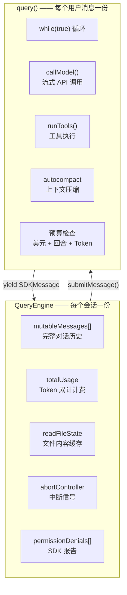
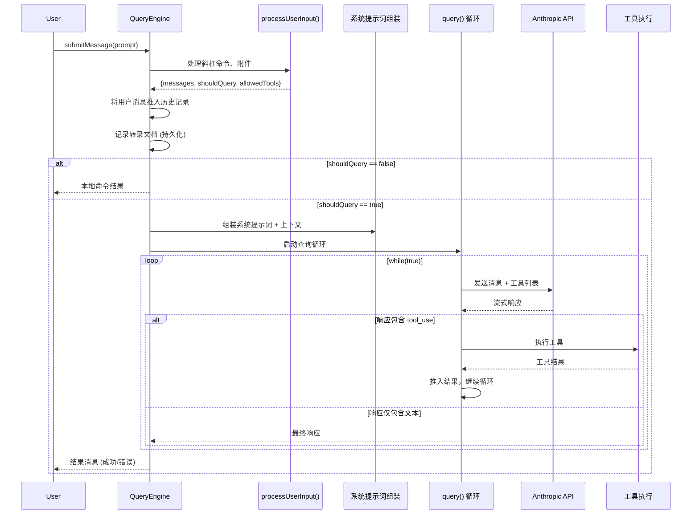

> 🌐 **语言**: [English →](../01-query-engine.md) | 中文

# 查询引擎 (QueryEngine)：Claude Code 的大脑

> **源文件**：`QueryEngine.ts` (1,296 行), `query.ts` (1,730 行), `query/` 目录

## TL;DR

QueryEngine 是 Claude Code 整个生命周期的核心编排器。它负责拥有会话状态、管理 LLM 查询循环、处理流式传输、跟踪成本，并协调从用户输入处理到工具执行的一切工作。`query()` 中的核心循环是一个刻意设计的简单 `while(true)` 异步生成器（AsyncGenerator） —— 所有的智能都存在于 LLM 中，脚手架（Scaffold）被有意设计为“愚钝”的。

---

## 1. 两层架构：QueryEngine (会话级) + query() (回合级)

引擎被分为具有不同生命周期的两层：



| 层级 | 生命周期 | 核心职责 |
|-------|----------|----------------|
| `QueryEngine` | 每个会话 (Conversation) | 会话状态、消息历史、累计用量、文件缓存 |
| `query()` | 每个用户消息 (Turn) | API 循环、工具执行、自动压缩、预算强制执行 |

---

## 2. submitMessage() 生命周期

每次调用 `submitMessage()` 都遵循一个精确的序列：



### 第一阶段：输入处理
`processUserInput()` 处理：
- **斜杠命令** (`/compact`, `/clear`, `/model` 等)
- **文件附件** (图片、文档)
- **输入规范化** (内容块与纯文本的转换)
- **工具白名单**

如果 `shouldQuery` 为 false（例如 `/clear`），结果将直接返回，而不调用 API。

### 第二阶段：上下文组装
系统提示词从多个来源动态组装，包括 CLAUDE.md、当前目录信息、已安装技能以及插件提供的上下文。

### 第三阶段：query() 循环
核心循环是一个 `while(true)` 的异步生成器，它处理与 LLM 的多轮交互。

---

## 3. query() 循环：1,730 行代码下的“混沌控制”

`query.ts` 中的 `query()` 函数是工具执行的心脏。尽管长达 1,730 行，其核心结构却很简单：

```
while (true) {
    1. 预处理：snip → microcompact → context collapse → autocompact (压缩流水线)
    2. 调用 API：流式获取响应
    3. 后处理：执行工具，处理错误
    4. 决策：继续 (发现 tool_use) 或 终止 (end_turn)
}
```

### 预处理流水线
在每次 API 调用前，消息会通过多级压缩：
- **工具结果预算**：限制工具输出的大小。
- **Snip (剪裁)**：移除陈旧的对话片段。
- **Microcompact (微压缩)**：缓存感知的文件编辑记录。
- **Context Collapse (上下文折叠)**：归档旧的回合。
- **Autocompact (自动压缩)**：当接近 Token 限制时进行全文摘要。

---

## 4. 状态管理：消息分发中心

在 `submitMessage()` 内部，一个大型 `switch` 语句负责路由每种消息类型（assistant, user, progress, stream_event, system 等）。设计关键点：**每种消息类型**都通过相同的 yield 管道分发，确保了通信路径的单一性和可靠性。

---

## 5. 值得借鉴的设计模式

### 模式 1：异步生成器 (AsyncGenerator) 作为通信协议
整个引擎通过 `yield` 进行通信。没有回调，没有事件触发器。异步生成器提供了背压（Backpressure）控制和完美的取消机制（`.return()`）。

### 模式 2：带有不可变快照的可变状态
引擎维护一个可变的消息数组以实现跨回合持久化，但在每次查询循环迭代时都会获取不可变快照。

### 模式 3：通过闭包注入权限限制
权限跟踪是透明注入的 —— 查询循环并不知道自己正在被监控。

### 模式 4：基于水印的错误范围界定
引擎通过保存最后一次错误的水印（参考）来回溯错误，而不是通过计数器。这种方式在环形缓冲区滚动时依然有效。

---

## 总结

| 维度 | 细节 |
|--------|--------|
| **QueryEngine** | 1,296 行，负责单个会话生命周期，管理历史与用量 |
| **query()** | 1,730 行，单回合 `while(true)` 循环，负责工具执行 |
| **通信方式** | 纯异步生成器 —— 无回调，无事件分发 |
| **预处理** | 5 级压缩流水线 (预算 → 剪裁 → 微压缩 → 折叠 → 自动压缩) |
| **预算限制** | 美元、回合、Token —— 全都在循环中强制执行 |
| **关键原则** | “愚钝的脚手架，聪明的模型” —— 循环必须保持简单，复杂逻辑留给 LLM |
