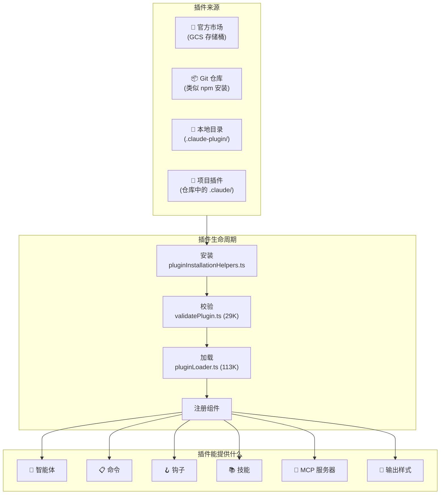

> 🌐 **语言**: [English →](../04-plugin-system.md) | 中文

# 插件系统：44 个文件，全生命周期管理

> **源文件**：`utils/plugins/` (44 个文件, 18,856 行), `components/ManagePlugins.tsx` (2,089 行)

## TL;DR

Claude Code 在底层隐藏了一个完整的插件生态系统 —— 包括插件市场、依赖解析、自动更新、黑名单、ZIP 缓存和热重载。它比官方文档所暗示的要复杂得多。单单是插件加载器 (`pluginLoader.ts`) 就有 113K 字节 —— 比大多数完整的 npm 包还要大。

---

## 1. 插件架构概览



---

## 2. 插件清单 (Manifest)

每个插件都必须有一个 `.claude-plugin/plugin.json` 清单：

```typescript
// 来自 schemas.ts (60K —— 代码库中最大的 schema 文件)
{
  "name": "my-plugin",
  "description": "这个插件做什么的描述",
  "version": "1.0.0",
  "commands": ["commands/*.md"],
  "agents": ["agents/*.md"],
  "hooks": { ... },
  "mcpServers": { ... },
  "skills": ["skills/*/SKILL.md"],
  "outputStyle": "styles/custom.md"
}
```

`schemas.ts` 中的 Schema 校验代码长达 **60,595 字节** —— 比大多数完整的插件还要大。它会校验从命令行 Frontmatter 到 MCP 服务器配置的一切内容。

---

## 3. 插件系统核心文件

| 文件 | 大小 | 用途 |
|------|------|---------|
| **`pluginLoader.ts`** | **113K** | 核心加载器 —— 发现、读取、校验并注册所有插件 |
| **`marketplaceManager.ts`** | **96K** | 插件市场浏览、搜索及从官方目录安装 |
| **`schemas.ts`** | **61K** | 适用于所有插件清单格式的 Zod 校验 Schema |
| **`installedPluginsManager.ts`** | **43K** | 管理已安装插件的状态、启用和停用 |
| **`loadPluginCommands.ts`** | **31K** | 解析带有 YAML Frontmatter 的 Markdown 命令文件 |
| **`mcpbHandler.ts`** | **32K** | 桥接处理器，用于处理插件提供的 MCP 服务器 |
| **`validatePlugin.ts`** | **29K** | 插件启用前的多重校验 |
| **`pluginInstallationHelpers.ts`** | **21K** | Git 克隆、npm 安装、依赖解析 |
| **`mcpPluginIntegration.ts`** | **21K** | 将插件声明的 MCP 服务器集成到工具池中 |
| **`marketplaceHelpers.ts`** | **19K** | 市场操作的辅助函数 |
| **`dependencyResolver.ts`** | **12K** | 解析插件的依赖图 |
| **`zipCache.ts`** | **14K** | 将下载的插件缓存为 ZIP 文件以便离线使用 |

---

## 4. 插件生命周期

### 4.1 发现
插件从多个位置被发现，优先级依次为：
1. **内置插件** —— 与二进制文件捆绑在一起。
2. **项目插件** —— 项目中的 `.claude/` 目录。
3. **用户插件** —— `~/.config/claude-code/plugins/` 目录。
4. **市场插件** —— 官方的 GCS 存储桶目录。

### 4.2 安装

从解析市场输入到解析依赖，再到克隆/下载 ZIP，最终落库到 `installedPlugins.json`，形成了一条严密的安装链路。

### 4.3 校验

`validatePlugin.ts` (29K) 会执行广泛的检查：
- 清单 Schema 校验 (Zod)
- 命令文件语法校验
- 钩子命令安全性检查
- MCP 服务器配置校验
- 循环依赖检测
- 版本兼容性检查

### 4.4 加载

作为代码库中第二大的文件，`pluginLoader.ts` (113K) 处理：
- 并行加载所有插件组件
- 钩子注册与智能体定义合并
- 带有去重功能的命令注册
- 启动 MCP 服务器并注册技能目录
- **错误隔离**（一个插件崩溃不会影响其他插件）

---

## 5. 市场系统

### 官方市场 
市场是一个服务于插件目录的 GCS (Google Cloud Storage) 存储桶。它包含：
- **启动检查**：在启动时检查插件更新。
- **自动更新**：后台的自动更新机制。
- **黑名单**：可远程禁用被攻破或违规的插件。
- **安装统计**：用于评估市场受欢迎程度的监控。

### ZIP 缓存系统
下载的插件被缓存为 ZIP 文件，以避免重复下载，并支持离线使用。使用内容哈希作为键，实现跨版本和用户的去重。

---

## 6. 插件能提供什么

- **智能体 (Agents)**：通过 Markdown 文件定义，可作为子智能体调用。
- **命令 (Commands)**：通过带有 YAML Frontmatter 的 Markdown 定义斜杠命令（例如 `/review-pr`）。
- **钩子 (Hooks)**：注册生命周期事件（PreToolUse / PostToolUse）。
- **MCP 服务器**：声明自动启动的外部资源和工具服务器。
- **技能 (Skills)**：自动发现带有匹配模式的技能。
- **输出样式 (Styles)**：定制化输出格式（例如讲解模式、学习模式）。

---

## 7. 安全与信任模型

- **插件策略**：来自不受信任来源的插件需要用户明确批准。官方市场的“受管（Managed）”插件享有更高的信任级别。
- **黑名单**：远程黑名单可通过 ID 停用插件，每次启动和加载插件时都会检查。
- **孤儿插件过滤**：检测并拦截源仓库已被删除的插件，防止悬空引用。

---

## 8. 值得借鉴的设计模式

### 模式 1：默认隔离 (Isolation by Default)
每个插件都隔离加载。加载器将每个插件的加载过程封装在 `try/catch` 中，单独报告失败情况。一个插件崩溃绝不会连累其他插件。

### 模式 2：带优先级的多源发现
来自不同来源的插件合并时有明确的优先级规则。项目级别的插件会覆盖用户级别的插件。

### 模式 3：内容寻址缓存
ZIP 缓存使用内容哈希作为键，不仅提高了安全性，还天然支持跨版本和多用户的去重。

---

## 总结

| 维度 | 细节 |
|--------|--------|
| **总代码量** | 仅 `utils/plugins/` 目录下就包含 44 个文件，18,856 行 |
| **最大文件** | `pluginLoader.ts` (113K), `marketplaceManager.ts` (96K) |
| **插件来源** | 内置、项目内、用户配置、官方市场 (GCS) |
| **提供组件** | 智能体、命令、钩子、技能、MCP 服务器、输出样式 |
| **市场机制** | GCS 存储桶目录、自动更新、黑名单、安装统计 |
| **安全机制** | 工作区信任、强制校验、远程黑名单、孤儿检测 |
