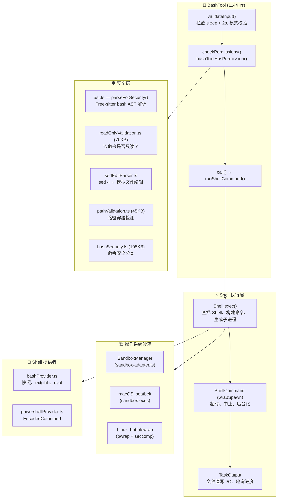
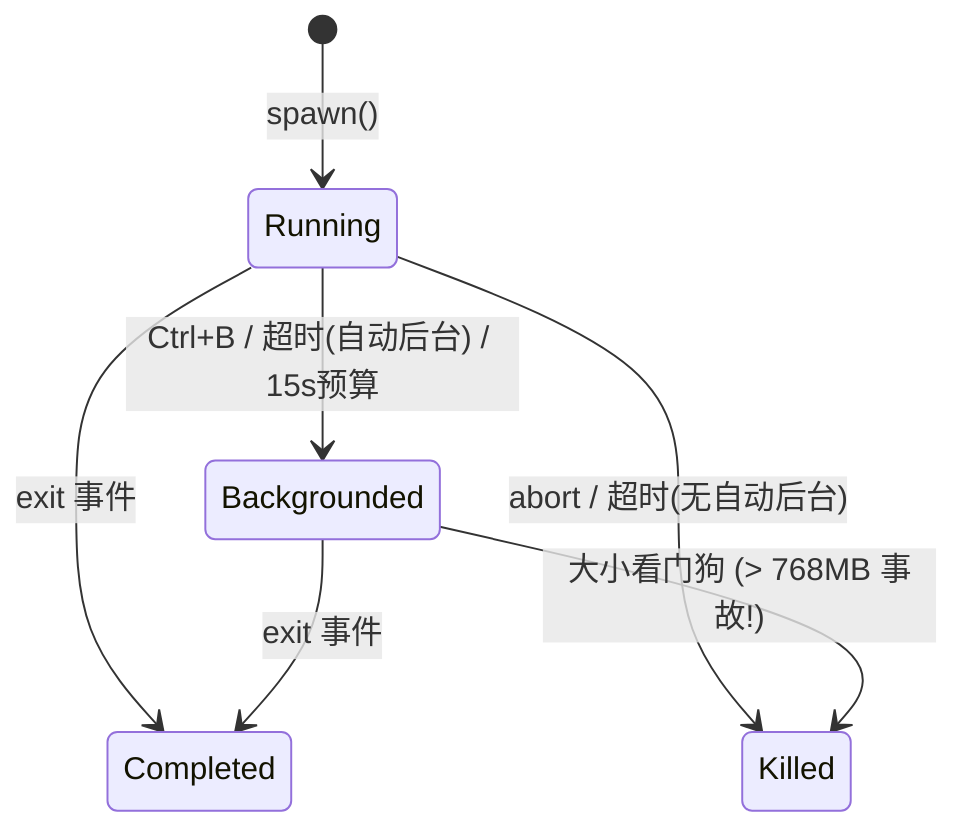
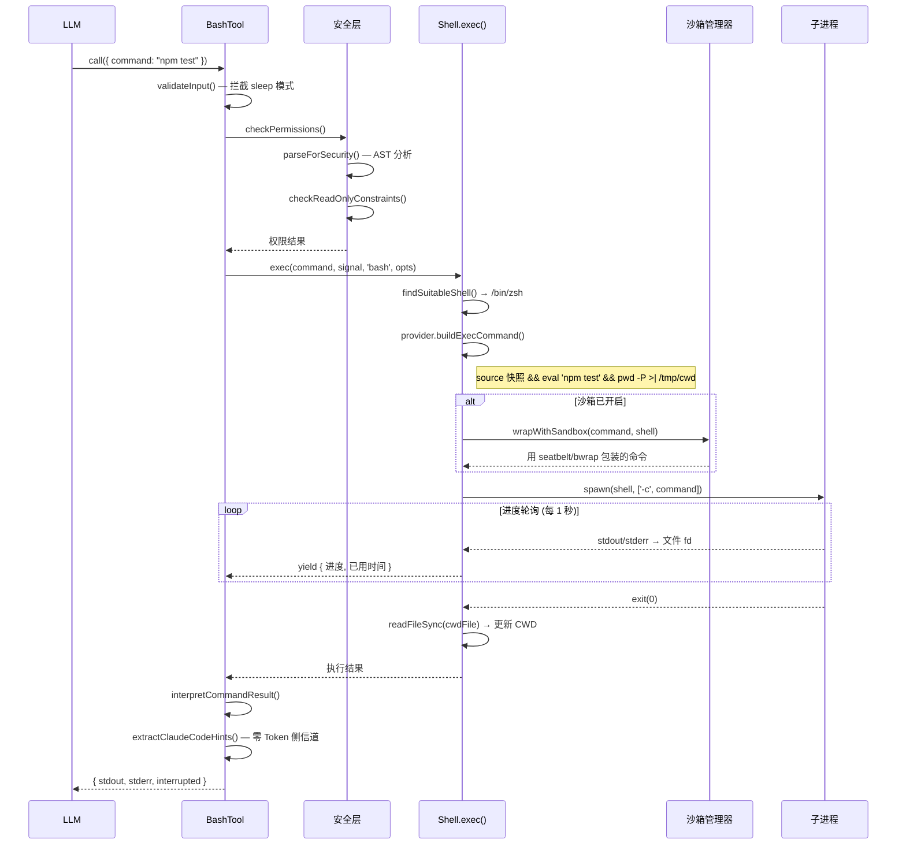

# 06 — Bash 执行引擎：沙箱、管道与进程生命周期

> **范围**: `tools/BashTool/` (18 个文件, ~580KB), `utils/Shell.ts`, `utils/ShellCommand.ts`, `utils/bash/` (15 个文件, ~430KB), `utils/sandbox/` (2 个文件, ~37KB), `utils/shell/` (10 个文件, ~114KB)
>
> **一句话概括**: Claude Code 如何安全地执行任意 Shell 命令 —— 从解析 `ls && rm -rf /` 到操作系统级沙箱 —— 全程不慌不忙。

---

## 架构概览



---

## 1. BashTool：外壳（双关语）

入口点是 `BashTool.tsx` —— 一个 1144 行的工具定义，使用标准的 `buildTool()` 模式构建。输入模式看似简单：

```typescript
z.strictObject({
  command: z.string(),
  timeout: semanticNumber(z.number().optional()),
  description: z.string().optional(),
  run_in_background: semanticBoolean(z.boolean().optional()),
  dangerouslyDisableSandbox: semanticBoolean(z.boolean().optional()),
  _simulatedSedEdit: z.object({...}).optional()  // 对模型隐藏
})
```

### 隐藏的 `_simulatedSedEdit` 字段

这是一个安全关键的设计：`_simulatedSedEdit` **始终从模型可见的 schema 中移除**。它仅在用户通过权限对话框批准 sed 编辑预览后内部设置。如果暴露给模型，模型就能通过将一个无害命令与任意文件写入配对来绕过权限检查。

### 命令分类

在任何命令运行之前，BashTool 会对其进行 UI 分类：

- **搜索命令** (`find`, `grep`, `rg` 等) → 可折叠显示
- **读取命令** (`cat`, `head`, `tail`, `jq`, `awk` 等) → 可折叠显示
- **语义中性命令** (`echo`, `printf`, `true` 等) → 分类时跳过
- **静默命令** (`mv`, `cp`, `rm`, `mkdir` 等) → 显示 "Done" 而非 "(No output)"

对于复合命令（`ls && echo "---" && ls dir2`），**所有**部分都必须是搜索/读取操作，整个命令才会被折叠。语义中性命令是透明的。

---

## 2. `runShellCommand()` 生成器

执行的核心是一个 **AsyncGenerator** —— 一种优雅地将进度报告与命令完成统一起来的设计：

```typescript
async function* runShellCommand({...}): AsyncGenerator<进度, 结果, void> {
  // 1. 判断是否允许自动后台化
  // 2. 通过 Shell.exec() 执行
  // 3. 等待初始阈值（2秒）后才显示进度
  // 4. 由共享轮询器驱动的进度循环
  while (true) {
    const result = await Promise.race([结果Promise, 进度信号])
    if (result !== null) return result
    if (已后台化) return 后台化结果
    yield { type: 'progress', output, elapsedTimeSeconds, ... }
  }
}
```

### 三条后台化路径

| 路径 | 触发条件 | 决策者 |
|------|---------|--------|
| **显式** | `run_in_background: true` | 模型 |
| **超时** | 命令超过默认超时时间 | `shellCommand.onTimeout()` |
| **助手模式** | 主代理中阻塞 > 15 秒 | `setTimeout()` + 15秒预算 |
| **用户** | 执行期间按 Ctrl+B | `registerForeground()` → `background()` |

`sleep` 命令被特别禁止自动后台化 —— 除非显式请求，否则在前台运行。

---

## 3. Shell 执行层 (`Shell.ts`)

### Shell 发现

Claude Code 对支持哪些 Shell 有明确立场：

```typescript
// 1. 检查 CLAUDE_CODE_SHELL 覆盖（必须是 bash 或 zsh）
// 2. 检查 $SHELL（必须是 bash 或 zsh）
// 3. 探测：which zsh, which bash
// 4. 搜索备用路径：/bin, /usr/bin, /usr/local/bin, /opt/homebrew/bin
```

**仅支持 bash 和 zsh**。Fish、dash、csh —— 全部拒绝。

### 进程生成：文件模式 vs. 管道模式

一个关键的架构决策驱动 I/O 性能：

**文件模式（bash 命令默认）**：stdout 和 stderr **共用同一个文件描述符**。这意味着 stderr 与 stdout 按时间顺序交错 —— 没有单独的 stderr 处理。

关于原子性保证：
- **POSIX**: `O_APPEND` 使每次写入原子化（寻址到末尾 + 写入）
- **Windows**: 使用 `'w'` 模式，因为 `'a'` 会剥离 `FILE_WRITE_DATA`，导致 MSYS2/Cygwin 静默丢弃所有输出
- **安全性**: `O_NOFOLLOW` 防止符号链接攻击

**管道模式（用于钩子/回调）**：使用 StreamWrapper 实例将数据导入 TaskOutput。

### CWD 跟踪

每个命令以 `pwd -P >| /tmp/claude-XXXX-cwd` 结尾。子进程退出后，使用**同步** `readFileSync` 更新 CWD。NFC 规范化处理 macOS APFS 的 NFD 路径存储问题。

---

## 4. ShellCommand：进程包装器



### 大小看门狗

后台任务直接写入文件描述符，**没有 JS 参与**。一个卡住的追加循环曾经填满了 768GB 的磁盘。修复方案：每 5 秒轮询文件大小，超过限制时 `SIGKILL` 终止整个进程树。

### 为什么用 `exit` 而非 `close`

代码使用 `'exit'` 而非 `'close'` 来检测子进程终止：`close` 会等待 stdio 关闭，包括继承了文件描述符的孙进程（如 `sleep 30 &`）。`exit` 在 Shell 本身退出时立即触发。

---

## 5. Bash 提供者：命令组装流水线

`bashProvider.ts` 构建传递给 Shell 的实际命令字符串：

```
source /tmp/snapshot.sh 2>/dev/null || true
&& eval '<引号包裹的用户命令>'
&& pwd -P >| /tmp/claude-XXXX-cwd
```

### Shell 快照

首次命令前，`createAndSaveSnapshot()` 将用户的 Shell 环境（PATH、别名、函数）捕获到临时文件。后续命令 `source` 此快照，而非运行完整的登录 Shell 初始化（跳过 `-l` 标志）。

### ExtGlob 安全

每个命令前都**禁用**扩展 glob 模式：恶意文件名中的 glob 模式可能在安全验证*之后*但执行*之前*展开。

### `eval` 包装器

用户命令被包裹在 `eval '<command>'` 中，使别名（从快照加载）能在第二次解析时被展开。

---

## 6. 操作系统级沙箱

`sandbox-adapter.ts`（986 行）桥接 Claude Code 的设置系统与 `@anthropic-ai/sandbox-runtime`：

### 平台支持

| 平台 | 技术 | 说明 |
|------|------|------|
| **macOS** | `sandbox-exec` (seatbelt) | 基于配置文件，支持 glob |
| **Linux** | `bubblewrap` (bwrap) + seccomp | 命名空间隔离，**不支持 glob** |
| **WSL2** | bubblewrap | 支持 |
| **WSL1** | ❌ | 不支持 |
| **Windows** | ❌ | 不支持 |

### 安全：设置文件保护

沙箱**无条件拒绝写入**设置文件 —— 防止沙箱内的命令修改自己的沙箱规则，这是经典的沙箱逃逸向量。

### 裸 Git 仓库攻击

一个精妙的安全措施阻止了如下攻击：沙箱内的进程植入文件（`HEAD`、`objects/`、`refs/`）使工作目录看起来像一个裸 git 仓库。当 Claude 的*非沙箱* git 后续运行时，`is_git_directory()` 返回 true，而恶意的 `config` 中的 `core.fsmonitor` 就能逃逸沙箱。

防御方案：
- 已存在的文件 → 拒绝写入（只读绑定挂载）
- 不存在的文件 → 命令执行后立即清扫（删除任何被植入的文件）

---

## 7. 完整执行流程



---

## 8. 设计洞察

### 为什么合并 stdout 和 stderr？

通过将两者导入同一个文件描述符，Claude Code 避免了经典的竞态条件 —— 并发写入的 stdout 和 stderr 到达顺序混乱。

### Claude Code 提示协议

当命令在 `CLAUDECODE=1` 环境下运行时，CLI/SDK 可以向 stderr 发出 `<claude-code-hint />` 标签。BashTool 扫描这些标签，记录后用于插件推荐，然后**剥离**它们使模型永远看不到 —— 一条**零 Token 侧信道**。

### AsyncGenerator 实现进度：优雅的简约

`runShellCommand()` 的生成器模式值得学习。不用回调、事件发射器或 rxjs observable，一个简单的 `yield` 在 `while(true)` 循环中产生进度更新。`Promise.race([结果Promise, 进度信号])` 模式在单个 await 中优雅地处理完成和进度。

---

## 组件总结

| 组件 | 行数 | 角色 |
|------|------|------|
| `BashTool.tsx` | 1,144 | 工具定义、输入/输出模式、分类 |
| `bashPermissions.ts` | ~2,500 | 带通配符的权限匹配 |
| `bashSecurity.ts` | ~2,600 | 命令安全分类 |
| `readOnlyValidation.ts` | ~1,700 | 只读约束检查 |
| `pathValidation.ts` | ~1,100 | 路径穿越和逃逸检测 |
| `Shell.ts` | 475 | Shell 发现、进程生成、CWD 跟踪 |
| `ShellCommand.ts` | 466 | 进程生命周期、后台化、超时 |
| `sandbox-adapter.ts` | 986 | 设置转换、OS 沙箱编排 |
| `bashProvider.ts` | 256 | 命令组装、快照、eval 包装 |
| `bash/` 解析器 | ~7,000+ | AST 解析、heredoc、引号、管道处理 |

Bash 执行引擎是 Claude Code 最安全敏感的子系统。它展示了**纵深防御**策略：应用层命令解析 → 权限规则 → 沙箱包装 → 操作系统内核级强制执行。每一层独立防止不同类别的攻击，当个别层不可用时系统也能优雅降级。

---

**下一篇**: [07 — 权限流水线 →](07-permission-pipeline.md)

**上一篇**: [← 05 — 钩子系统](05-hook-system.md)
